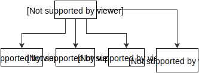

# Patterns

This section explores **software design patterns** that can be used to build modular, declarative motion systems.

We'll explore the use of these patterns in the section on [Runtimes](runtimes.md).

## The Intention/Actor pattern

The Intention/Actor pattern separates **what** from **how** in a motion system.

Intentions are the what. Actors are the how.

> This separation enables [Runtimes](runtimes.md) to offload expensive work to separate threads or processes.

### What (Intention)

Intention is **what you want something to do**.

> We’ve been careful to use the word Intention rather than animation. The word Intention can describe Gestures, Physical Simulation, and other Primitives. For example, an element could be both draggable and asked to fade in. Runtimes that think in terms of Intention are more capable of coordinating rich, interactive motion.
> 
> 
> 
> Strongly-typed programming languages can define Intention as an empty protocol or interface. This allows existing entities to be described as Intentions.
> 
>     protocol Intention {}
>     extension Animation: Intention {
>     }
> 
> Strongly-typed programming-languages that **lack** protocols or interfaces can create "container" objects. These container objects are part of an Intention class hierarchy.
> 
>     class Intention {}
>     class AnimationIntention: Intention {
>       var animation
>     }
> 
> [Duck-type](https://en.wikipedia.org/wiki/Duck_typing) languages may treat any object as potentially-an-Intention.

Consider the following pseudo-code:

    tween = FadeInTween()
    element.addIntention(tween)

Here, `FadeInTween` represents the concept of Intention. The logic that fulfills FadeInTween **is not executed here**. The Intention has been handed off to some system via `addIntention`. That system will soon execute the Intention.

Also consider this pseudo-code:

    behavior = CustomBehavior()
    behavior.animate = function() {
      // A custom animation.
    }
    element.addIntention(behavior)

In this example, `CustomBehavior` represents the concept of Intention. The `animate` function can be executed by a separate system.

### Many-to-Many

Many Intentions can be attached to a single target.

A single Intention can be attached to many targets.

Consider this pseudo-code:

    draggable = DraggableGesture()
    pinchable = PinchableGesture()
    rotatable = RotatableGesture()
    anchoredSpring = AnchoredSpringAtLocation(x, y)
    element.addIntentions(draggable, pinchable, rotatable, anchoredSpring)
    element2.addIntention(draggable)

`element` is now directly manipulable. When the user lets go of the element, it is pulled back to the x,y coordinate using a physical simulation of a dampened spring.

`element2` can simply be dragged.

### How (Actor)

An **Actor**'s sole responsibility is to fulfill the contract defined by a corresponding Intention.

> How an Actor is implemented — be it an anonymous function or a class instance with state — is less important than that the Actor fulfills its contract. We leave it as a challenge to the reader to evaluate the merits of purely functional systems vs object-oriented systems.

**Input**: Actors can be asked to recalculate either in response to user input or whenever the platform is ready to draw another frame.

**Activity**: An Actor is either active or dormant. An **active** Actor will generate change in response to input. Conversely, a **dormant** actor will not generate change in response to input.

Examples of *active* Actors:

- Fulfilling a Pan Intention while pan gesture events are being generated. 
- Fulfilling a Spring Attachment Intention and the body has not yet reached its final resting state. 

Examples of *dormant* Actors:

- Fulfilling a Pan Intention for which there are no pan gesture events. 
- Fulfilling a Spring Attachment Intention and the body has reached its final resting state. 

The process or thread on which an Actor executes its contract depends on a combination of the types of Primitives it employs and assumptions already made by a given platform.

> Imagine a platform that executes user input on the main thread of the application while Tween animations are executed on a separate process altogether. A Gesture Actor would likely execute on the main thread. A Tween Actor would likely execute some or all of its logic on the separate process.

## The Director/Intention pattern

A **Director** is a coordinating entity that describes an interactive experience by creating Intentions and associating them with specific elements.

> Imagine a transition between two states. A Director might create a Timeline and associate a variety of Tweens to various elements in the scene.

Directors may use Intentions that build upon any of the available Primitives. This enables the expression of **coordinated interactions**.

> Imagine a set of avatars as being draggable and, when not being dragged, the avatars gravitate toward the edges of a defined area. The Director might associate a Draggable intention with a given avatar. The Director might also associate a Spring Attachment intention to the avatar once the user has released it.

**Multiple Directors** can affect a given set of elements. The software designer is able to choose reasonable lines of responsibility.

> Imagine a horizontal carousel that can be expanded full screen. One Director might govern the horizontal movement of the carousel. Another Director might govern the expansion/collapse of the carousel to/from full screen.

It is important that the Director not have direct access to the Actors that implement the system. This separation of concerns allows Directors to live in the application space, while Actors are free to live anywhere else.