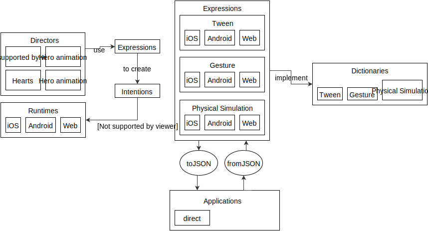

# Runtimes

This section explores one specification for a **declarative motion engine**.

## Overview

The purpose of a Runtime is to **coordinate** the expression of Plans in an application. We will apply the [Plan/Fulfillment](patterns/plan-fulfillment.md) and [Coordinator/Plan](patterns/coordinator-plan.md) patterns to the design of this system.

Throughout this chapter we will apply a metaphor oriented around theater terminology. The metaphor primarily consists of **Directors**, **Actors**, and **Intentions**.

- A Director is a **coordinating** entity.
- An Intention is a **plan**.
- An Actor is expected to **fulfill** Intentions.

Directors register Intention with a Runtime. The Runtime creates Actors and pumps a variety of events to them. These events allow Actors to fulfill their Intentions.

  

### The Runtime

A Runtime must be able to initialize with zero arguments.

    class Runtime
      function init()

#### Essential state

A Runtime can be paused. A new Runtime is initially paused. A paused Runtime will not forward events to its Actors.

    class Runtime
      var paused: Boolean

A Runtime can be in two states: Active or Idle. The `state` property is readonly.

    RuntimeState {
      Idle
      Active
    }

    class Runtime
      readonly var state: RuntimeState

#### Director registration

A Runtime can store multiple Director instances.

    class Runtime
      var directors: [Director]

A Runtime can register new Director instances at any time.

    class Runtime
      function addDirector(Director)

When a Director is registered with 

Each Director may register an initial set of Intentions in a setup method.

After the Director registers its Intentions, the Runtime creates a collection of Actors that are able to fulfill the contract of the Intentions.

> TODO: There must exist some mechanism by which Intention and Actors are associated. The question that the Runtime will need to ask is “Which Actor can execute these Intentions?” This is being discussed in [#8](https://www.gitbook.com/book/material-motion/material-motion-starmap/discussions/8).

The Runtime now has a collection of Actors.

The Runtime is now responsible for forwarding events to Actors. (Link to Actor events).

A Runtime is constantly measuring the amount of energy in the system. Energy is defined as "the number of active Actors". If there is no energy then the Runtime should enter an idle state. This is an important part of minimizing battery consumption on mobile devices. (Link to Runtime states).

## Plans

Intentions are a concrete implementation of the **Description** part of the [Description/Execution](patterns.md) pattern.

Strongly-typed programming languages can define Description as an empty protocol or interface. This allows existing entities to be described as Descriptions.

    protocol Description {}
    extension Animation: Description {
    }

Strongly-typed programming-languages that **lack** protocols or interfaces can create "container" objects. Such a container object would be part of an Description class hierarchy. This is important because it allows [Runtimes](runtimes.md) to think in terms of Description types.

     class Description {}
     class AnimationDescription: Description {
       var animation
     }
 
[Duck-typed](https://en.wikipedia.org/wiki/Duck_typing) languages may treat any object as potentially-an-Description.

## Execution

TODO: Define Actors.

**Events**: Executions can ask to receive the following events:

- Animation events.
- Gesture recognition events.

**Activity**: An Execution is either active or dormant. An **active** Execution will generate change in response to input. Conversely, a **dormant** Execution will not generate change in response to input.

Examples of *active* Executions:

- Fulfilling a Pan Plan while pan gesture events are being generated. 
- Fulfilling a Spring Attachment Plan and the body has not yet reached its final resting state. 

Examples of *dormant* Executions:

- Fulfilling a Pan Plan for which there are no pan gesture events. 
- Fulfilling a Spring Attachment Plan and the body has reached its final resting state. 

The process or thread on which an Execution executes its contract depends on a combination of the types of Primitives it employs and assumptions already made by a given platform.

> Imagine a platform that executes user input on the main thread of the application while Tween animations are executed on a separate process altogether. A Gesture Execution would likely execute on the main thread. A Tween Execution would likely execute some or all of its logic on the separate process.

## Intention registration

TODO: Discuss how Intentions are registered with the system. Specifically, discuss how Intentions should interact with Plugins like view duplication.

## Director events

### Setup

### Teardown

### Gesture recognition

Directors may listen to Gesture Recognizer events in order to facilitate high-level coordination of Intentions.

## Runtime states

- Initializing
- Idle
- Active

## Actor state

- The direct target (what the Actor was initially registered to).
- The dynamic target (may not be the target).
- Permanently-registered Intentions.
- Intentions registered by name.

TODO: There is likely value in maintaining this state outside of the Actor instances themselves. Provide the actors with a variable that enables easy access of the above state (perhaps nicely scoped to the Actor). E.g. state.intentions or state.intentionForName("name").

## Actor events

The Runtime identifies which events each Actor expects to receive. Events include:

- intention registration,
- animation events, and
- gesture recognition events.

### Intention registration

TODO: Discuss adding permanent intentions.

TODO: Discuss adding named intentions.

### Animation

The animate event is invoked when the system is about to render a new frame. This event is often called many times per second.

Each Actor is responsible for calculating time deltas. Take care to respect platform animation speed scalars.

### Gesture recognition

The gesture event is invoked when a gesture recognizer's state has changed.

## Plugins

TODO: Write an intro. Emphasize that plugins are one of the most platform-specific parts of a runtime.

### Plugin events

#### Runtime state changed

- Useful for transition system handoff.

#### Actor created for target

- Useful for view duplication. This event must allow the plugin to change the "associated target" for all Actors referencing a given target.

### Specific plugins

#### View duplication

TODO: Discuss when view duplication hooks into the system. Emphasize the need to hook in to intention registration events with new elements in the system.

Required events:

- First-time registration of Intention to element 

#### Transition

Coordinate events with the operating system’s existing transition system.

Required events:

- Did start 
- Did idle 

## Companions to a Runtime

TODO: Write an intro. These systems coordinate the creation of Runtimes in reaction to other events. The most simple example is that of a "Transition" coordinator.

### Scripting

TODO: Discuss how one might integrate a scripting language with a Runtime.

### Transition coordination

This system allows you to define which Directors to use for a transition between two “Screens” in an application.

- Discuss the “Narrator” concept.

# Diagrams

Runtimes in relation to the overall Starmap ecosystem.

## Outline (notes, not final copy)

TODO: The following content is an outline and needs to be folded into the above content.

- Runtime can have many Directors. Allow multiple Directors to share Actors. 
- Directors receive following events: 
    - Registration - expected to register intentions in this phase 
    - Input handling - may register new intentions 
- Actors receive following events from Runtime: 
    - Initialization 
    - Display link pump -&gt; returns Bool indicating “isActive?” 
    - Gesture events 
- Actor types include: 
    - Gestural actors 
    - Simulation actors 
    - Event actors 
        - Must have way to communicate to Runtime when the Actor becomes inactive (emphasis: this supports “external” animation systems like Core Animation) 

- Intention registration mechanism 
    - Associates intentions with elements 
    - Intentions can be added to elements permanently 
    - An array of intentions can be added to an element with a name 
        - Named intentions allow for “state” changes 
        - Adding named intentions will remove all previous intentions for that element with the same name 

- Runtime receives all Intention requests from the Director, then creates all the necessary Actors to execute those requests 
- Runtime may hook in to the refresh rate for a screen and use this as a simulation pump. This pump will only be provided to actors (emphasis: not the director) 
- Support the following states: 
    - Initializing 
    - Idle - no actors are currently causing changes to the system (emphasis: includes no “active” gesture recognizers) 
    - Active 

- Support the following state changes: 
    - Initializing -&gt; Idle|Active 
    - Idle -&gt; Active 
    - Active -&gt; Idle 

- Support Pausing the runtime 
- Support enumerating all registered intentions, elements, and actors 
    - Can be used to generate a console dump 
    - Can be used to build inspectors 

- Plugin system should enable listening to key events in a Runtime: 
    - When a new element has received intention, allow returning a new element that should be used instead (emphasis: this is for view duplication support) 
    - When a runtime’s current state has changed 

- Runtime should always be evaluating current “energy level” of the system. If Runtime reaches a steady state, this should be an event. (emphasis: allows other systems to react to runtime completion such as transitions) 
- Runtime should support some semblance of Actor priority. 
    - Unclear what this looks like, but order of Actor execution could potentially matter. Assumption presently is that Actors execute Intention in order that they were registered. 

- Existing Runtimes: 
    - Core Animation 
    - Android’s animation system 
    - Web animations
