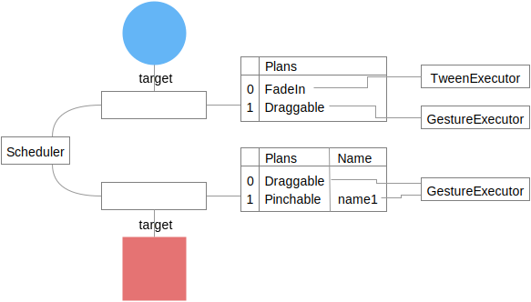

Status of this document: **Drafting by featherless**

# Runtimes

The purpose of a Runtime is to enable the **coordination** of interactive motion in an application. A Runtime is an implementation of the [Plan/Fulfillment](patterns/plan-fulfillment.md) pattern. An instance of a Runtime is a delightful companion to a [Coordinator](patterns/coordinator-plan.md).

A Runtime instance must be able to do the following:

- Commit to Plans.
- Fulfill those Plans.

## Commit Plans

Plans are committed to Runtimes via Transactions.

A Transaction's public API should support the following operations:

- Associate a Plan with a target.
- Associate a named Plan with a target.
- Remove any Plan associated with a given name from a target.
- Enumerate the log of operations.

The log's order must match the order of the requested operations.

A Transaction must be explicitly committed to a Runtime; e.g. `runtime.commit(transaction)`.

Consider the following transaction pseudo-code:

    transaction = Transaction()
    transaction.add(FadeIn, circleView)
    transaction.add(Draggable, squareView)
    transaction.addNamed("name1", Pinchable, squareView)
    transaction.addNamed("name2", Rotatable, squareView)
    transaction.removeNamed("name2", squareView)
    transaction.add(Draggable, circleView)
    runtime.commit(transaction)

The Transaction's log might resemble the following pseudo-object:

    > transaction.log
    [
      {action:"add", plan: FadeIn, target: circleView},
      {action:"add", plan: Draggable, target: squareView},
      {action:"addNamed", plan: Pinchable, name: "name1", target: squareView},
      {action:"addNamed", plan: Rotatable, name: "name2", target: squareView},
      {action:"remove", name: "name2", target: squareView}
      {action:"add", plan: Draggable, target: circleView},
    ]

After committing the above transaction, our Runtime's internal state might resemble the following:

Note that `Rotatable` is not listed. This is because we also removed the named intention for "name2" in this Transaction.

The Runtime is now expected to fulfill its Plans.

## Fulfill Plans

A Runtime must translate Plans into executable logic.

### Plan ↔ Executor association

We'll assume a function exists that returns an object capable of fulfilling a Plan. We'll call such an object an **executor**. The method signature for this method might look like this:

    function executorForPlan(plan, target, existingExecutors) -> Executor

This function will use a `Plan type → Executor type` lookup table. The lookup can be implemented in many ways:

**Plan → Executor**

Plans define the Executor they require. This requires Plans to be aware of their Executors, which is not ideal. It does, however, avoid a class of problems that exist if Executors can define which Plans they fulfill.

**Executor → Plan**

Executors define which Plans they can fulfill. This approach allows Plans to be less intelligent. It introduces the possibility of Executors conflicting on a given Plan.

### On commit: generate executors

When a Transaction is committed, the Runtime must generate an executor for each Plan in the Transaction. Consider the Transaction log we'd explored above:

    > transaction.log
    [
      {action:"add", plan: FadeIn, target: circleView},
      {action:"add", plan: Draggable, target: squareView},
      {action:"addNamed", plan: Pinchable, name: "name1", target: squareView},
      {action:"addNamed", plan: Rotatable, name: "name2", target: squareView},
      {action:"remove", name: "name2", target: squareView}
    ]

Recall that the above log translated to the following internal state:

Let's create executors by calling our hypothetical `executorForPlan` on each target's Plans.

We've created three executors in total. `circleView` has two executors. `squareView` has one. We've also introduced a question to the reader: "Why is there only one gesture executor for the squareView?"

#### One executor per type of Plan

A single executor is created for every type of Plan registered to a target. This allows executors to maintain coherent state even when multiple Plans are concerned.

Consider the following pseudo-Transaction involving physical simulation Plans:

    transaction = Transaction()
    transaction.add(Friction.on(position), circleView)
    transaction.add(AnchoredSpring.on(position), circleView)
    runtime.commit(transaction)

Our circleView now has two Plans and one executor, a PhysicalSimulationExecutor. Both Plans are provided to the executor instance.

The executor now knows the following:

- It has two Forces, both affecting `position`.
- It needs to model `velocity` for the `position`.

The executor now creates some state that will track the position's velocity.

The executor can now:

1. convert each Plan into a physics force,
2. apply the force to the velocity, and
3. apply the velocity to the position

on every animation cycle.

Alternatively, consider how this situation would have played out if we had one executor per plan. There would now be two representations of `velocity` for the same `position`. On each animation step one executor would "lose". The result would be a confusing animation.

Note that "one executor per type of Plan" does not resolve the problem of sharing state across different types of Plans. This is an open problem.

### Repeated: forward animation events to executors

The Runtime is now expected to forward animation events to the executors.

Executors are informed of events via the following pseudo-algorithm:

    for every target
      for every executor
        executor.event()

A Runtime should make reasonable efforts to send relevant events to executors.

For example: if an executor does not care about the animation event then the Runtime should not inform the executor.

### Runtime active vs idle state

At any given time a Runtime can either be **idle** or **active**.

A Runtime is active when there is at least one active executor.

An executor can be active for any of the following reasons:

- The animate event returned a Boolean value of false.
- The executor has indicated some form of active **external activity**.

### External activity

Executors often depend on external systems to fulfill their Plans. An Executor is therefor responsible for informing the Runtime of two events:

- When external activity begins.
- When external activity ends.

External activity affects the active state of the Runtime. This can have propagating effects to systems watching the Runtime's current state.

The Runtime can provide executors with two methods:

    var activityWillStart = function(name)
    var activityDidEnd = function(name)

The name provided to these functions should be scoped to the executor, not globally to the runtime.