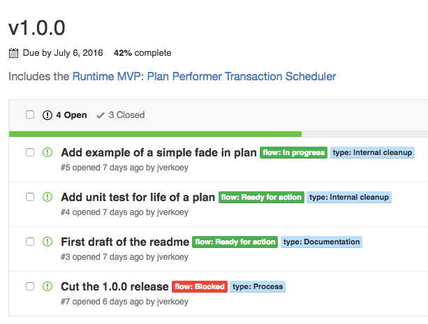

# GitHub issue flow

This article describes how the Material Motion team manages priorities and ongoing work as a distributed open source project. This article is written for anyone who's interested in or actively helping out with a material motion project.

## Communication

Frequent communication is paramount when working in a distributed open source team. Because our team is not located in one geographical location, we make heavy use of **distributed** workflow principles.

### Assignment is ownership

If an issue is assigned to you, it is assumed that you are actively working on the issue.

The inversion of this assumption is important: if you are not working on an issue, **please unassign yourself from it**.

We will periodically remove assignees from issues that do not appear to have progressed. Don't be alarmed; you can always re-assign the issue in the future once you begin work on the issue. We do this simply to avoid [cookie-licking](http://communitymgt.wikia.com/wiki/Cookie_Licking).

### Post updates to issues early and often

We encourage posting to issues early and often. This has many noticeable effects:

- Combats [cookie-licking](http://communitymgt.wikia.com/wiki/Cookie_Licking).
- Encourages asking for help.
- Helps avoid getting "lost in the weeds".

Some recommendations on communicating early and often:

**I've started working on the issue**

Explain your plan, what considerations you're making, and how long you expect the work to take.

This is also usually when you'd assign the issue to yourself.

**I'm considering changing the direction of my work**

It's rare that an issue is perfectly defined. When you find yourself changing the scope of what you're working on (I need this new tool; this bug has bigger ramifications; I need to try a completely new approach), post to the issue.

**I've started working on something else**

Context switching happens. When it happens, post to the issue. If you expect to be focusing on something else for a while, unassign yourself. This allows anyone else to start where you left off.

**I've gotten stuck, help!**

Explain how you got stuck, what alternatives you're considering, and whether you need help (use `@` mentions to ask for help).

**Randomly**

Random updates to the issue are a helpful way to let others know that the issue is being worked on. We encourage sharing emoji stories.

### Label flow

We use `flow:` labels to communicate the current state of an issue. See [our team repo's labels](https://github.com/material-motion/material-motion-team/labels).

Flow labels move through the following process:

### Label type

We also use labels to categorize the "type" of an issue. Types we use:

- Bug
- Documentation
- Feature request
- Internal cleanup
- Process
- Question
- Visual bug
- Working as intended

## Priorities

### Projects == GitHub repos, usually

For most of our platforms, each "project" maps to a single GitHub repository.

We do make use of [monorepos](http://danluu.com/monorepo/). Monorepos contain many projects. Monorepos make heavy use of `where:` labels to break down project-specific tasks.

### Roadmap defines project priority

We define our roadmap on Discord. Our roadmap defines cross-project priorities. This is a good place to answer the question of "which project are we focused on this week?"

See our [communication](../communication.md) article for an invite link to the channel.

### A milestone defines issue priority

Within a given project we use GitHub milestones to define relative issue priority. Issues at the top of the milestone are the most important.

For example, consider the [Runtime v1.0.0 milestone](https://github.com/material-motion/material-motion-runtime-objc/milestone/1):

In this milestone we can clearly see the work ahead of us and the current status of each issue.

If you'd like to take on a task the rule is simple: **choose any unassigned task near the top of the milestone**.