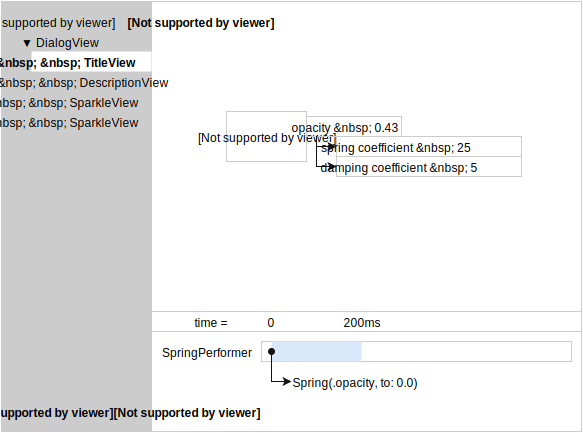

Status of this document:

# Debugging

TODO: Discuss debugging tools.

- Enumerating Plans and Executors currently active in a Runtime.
- Pausing animations.
- Slowing down animations.
- Scrubbing through animations.
- Direct tool integrations.

Mockup of debugging tool:

Notes:

- Left column shows element hierarchy.
- Right column shows current state + timeline.
- Timeline shows performer activity state and plan association over time.
- Current state shows graph of performers and their exposed values.
- If no element is selected, all performers should be shown in right-hand column.

Related to the Server in many ways. Likely a good deal of overlapping inspection tools.