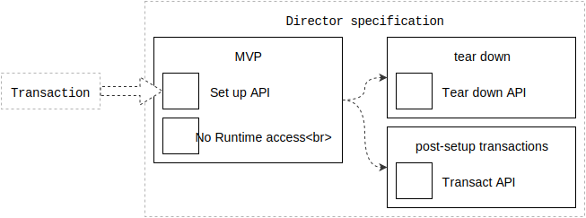

# Directors

A director is an object created for the purposes of describing motion. Its role is similar to that of the Controller in the Model-View-Controller pattern.

"Director" does not have to be a formal base type; or, put another way, the `TransitionDirector` and `InteractionDirector` that we explore here do not have to share a common sub-class or protocol.

Directors have little — if any — imperative code. Directors prefer to describe motion in terms of declarative plans.

Printable tech tree/checklist:

---

<tt>MVP</tt>

**Set up API**: A director implements a `setUp` function. This function will be invoked exactly once. This function accepts a transaction instance.

Example pseudo-code definition:

    function setUp(planEmitter)

Directors are expected to commit plans to `setUp`'s provided transaction .

Example pseudo-code implementation:

    function setUp(planEmitter) {
      planEmitter.addPlan(plan, to: targetA)
      planEmitter.addPlan(plan, to: targetB)
      ...
    }

**No access to the scheduler**: Directors do not have direct access to a scheduler.

The primary goal of this restriction is to minimize the number of novel APIs a director must interact with. A transaction is the preferred bridge between a director and a scheduler.

<tt>/MVP</tt>

---

<tt>feature: tear-down</tt>

Directors may implement a `tearDown` function. This function is invoked when the associated scheduler is about to terminate.

**Tear down API**: The `tearDown` function, if implemented, is invoked when the director's corresponding scheduler is about to terminate.

Pseudo-code example:

    function tearDown() {
      // Perform any cleanup work
    }

<tt>/feature: tear-down</tt>

---

<tt>feature: post-setup transactions</tt>

Directors may wish to register new plans after `setUp` has been invoked.

**Transact API**: A director may be provided with a *transaction initiation function*.

Example pseudo-code protocol:

    var transact // settable

The provided function implementation might resemble the following:

    var transact = function(work) {
      transaction = Transaction()
      work(transaction)
      scheduler.commit(transaction)
    }

The director can now start a new transaction by invoking `transact`.

Consider the following pseudo-code of a director responding to a gesture recognition event:

    function onGesture(gesture) {
      if gesture.state == Ended {
        self.transact(function(transaction) {
          transaction.add(plan, targetA)
        })
      }
    }

<tt>/feature: post-setup transactions</tt>

---
