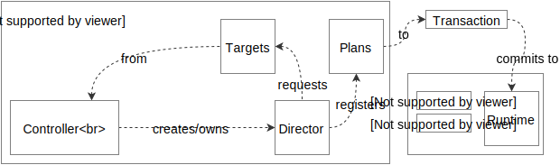

Status of this document:

# Director

This is the engineering specification for the Director abstract type.

A Director is an object created for the purposes of describing motion.

Directors have little — if any — imperative code. Directors prefer to describe motion in terms of declarative Plans.

---

<tt>MVP</tt>

**Set up API**: A Director implements a `setUp` function. This function will be invoked exactly once. This API accepts a Transaction instance.

Example pseudo-code:

    Director {
      function setUp(transaction)
    }

**Initial Plans**. The Director commits Plans in `setUp`.

Pseudo-code:

    function setUp(transaction) {
      transaction.add(plan, targetA)
      transaction.add(plan, targetB)
      ...
    }

`v1` **Providing targets**: Provide targets to Directors.

How targets are provided to a Director is up to the creator of the Director.

Common solutions include:

*Delegate pattern*. The Director requests targets via a delegate.

*Initialization*. Targets are provided to the Director's initializer.

<tt>/MVP</tt>

---

<tt>feature: tear-down</tt>

Directors may implement a `tearDown` function. This function will be invoked when their Runtime is about to terminate.

<tt>/feature: tear-down</tt>

---

<tt>feature: post-setup transactions</tt>

Directors may wish to register new Plans after `setUp` has been invoked.

Provide these Directors a *transaction initiation function*. Consider the following pseudo-code:

    # Typical set up
    director.setUp(transaction)
    
    director.transact = function(function(Transaction) work) {
      transaction = Transaction()
      work(transaction)
      runtime.commit(transaction)
    }

The Director can now start a new transaction by invoking `transact`.

Consider the following pseudo-code of a Director responding to a gesture recognition event:

    function onGesture(gesture) {
      if gesture.state == Ended {
        self.transact(function(transaction) {
          transaction.add(plan, targetA)
        })
      }
    }

<tt>/feature: post-setup transactions</tt>

---

## Specialized Directors

Specialized Directors should be provided for common operations.

- [Transition Directors](transition_directors.md)
- [Interaction Directors](interaction_directors.md)

TODO: Describe entity that manages creation of Director. This entity is responsible for creating a Director when appropriate, calling the setUp and tearDown methods, and owning the Runtime instance.

<!--

LGTM:

-->
