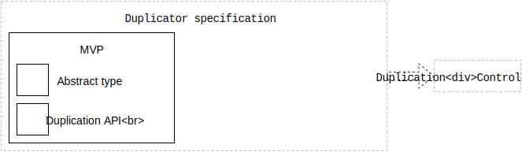

# Duplicator specification

This is the engineering specification for the `Duplicator` abstract type.

A instance of a `Duplicator` creates similar replicas of visual elements. Replicas do not necessarily need to be as functional as their original element.

Printable tech tree/checklist:

---

<tt>MVP</tt>

**Abstract type**: A `Duplicator` is an abstract type.

Example pseudo-code:

    protocol Duplicator {
    }

**Duplication API**: Provide an API for duplicating an element.

This API should accept an element and return an element.

Example pseudo-code:

    protocol Duplicator {
      function duplicate(Element element) -> Element
    }

<tt>/MVP</tt>

---
