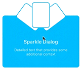

# Sparkle dialog demo

## Element hierarchy

- `SparkleDialog`
  - `Contents`
    - `Card2`
    - `Card1`
    - `Card3`
    - `Title`
    - `Detail`
    - `Scrim`

## Director

    func setUp(withDialogView dialogView: SparkleDialogView) {
      let size = dialogView.skrimView.bounds.size

      when(.collapsed) { make in
        make[dialogView.contentView].spring(.layerOpacity, to: dialogView.contentView.layer.opacity)
        make[dialogView.skrimView].spring(.layerSize, to: size)

        make[dialogView.titleLabel].spring(.layerPositionY,
                                           to: dialogView.titleLabel.layer.position.y)
        make[dialogView.titleLabel].spring(.layerOpacity, to: 0)
        make[dialogView.detaillabel].spring(.layerPositionY,
                                            to: dialogView.detaillabel.layer.position.y)
        make[dialogView.detaillabel].spring(.layerOpacity, to: 0)

        for card in dialogView.cards {
          make[card].spring(.layerRotation, to: 0)
          make[card].spring(.layerPositionX, to: card.layer.position.x)
          make[card].spring(.layerPositionY, to: card.layer.position.y)
        }
      }

      when(.expanded) { make in
        make[dialogView.contentView].spring(.layerOpacity, to: 1)
        make[dialogView.skrimView].spring(.layerSize, to: CGSize(width: size.width + 20,
                                                                 height: size.height + 20))

        make[dialogView.titleLabel].spring(.layerPositionY,
                                           to: dialogView.titleLabel.layer.position.y + 5)
        make[dialogView.titleLabel].spring(.layerOpacity, to: 1)
        make[dialogView.detaillabel].spring(.layerPositionY,
                                            to: dialogView.detaillabel.layer.position.y + 5)
        make[dialogView.detaillabel].spring(.layerOpacity, to: 1)

        let xOffset: [CGFloat] = [-20, 0, 20]
        let rotations: [Double] = [-45, 0, 45]
        for (i, card) in dialogView.cards.enumerated() {
          make[card].spring(.layerRotation, to: rotations[i] * M_PI / 180)
          make[card].spring(.layerPositionX, to: card.layer.position.x + xOffset[i])
          make[card].spring(.layerPositionY, to: card.layer.position.y - 20)
        }
      }

      dialogView.addGestureRecognizer(UITapGestureRecognizer(target: self, action: #selector(didTap)))
    }
