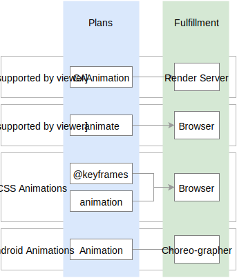

## Separation of plan/performance

This section defines a software design pattern. The pattern involves a [declarative separation](https://en.wikipedia.org/wiki/Declarative_programming) between **plans** and their **performance**.

**Plan**: a detailed proposal for what you want something to do or how you want it to behave.

**Perform**: the action of carrying out or accomplishing a plan.

Benefits of this separation:

- It allows performance to occur in a separate, potentially non-blocking context.
- It enables design tooling and bespoke applications to communicate in a language that isn't code.

## Examples of this separation

Most platforms have an implementation of this separation for tween animations. Few platforms have implemented this separation for other [primitives](../primitives.md).

### A plan of motion

We use *plan* to mean **what you want something to do** or **how you want it to behave**.

For example, "fade in" and "be draggable" are two distinct plans.

Consider the following pseudo-code:

    fadeIn = {
      property: 'opacity',
      from: 0,
      to: 1
    }
    system.addPlan(fadeIn, toTarget: target)

Here, the object `fadeIn` is the plan. The "fade in" logic **is not performed here**.

`addPlan` has registered the plan to a system. It does not matter which system, so long as the plan is eventually performed.

Also consider this pseudo-code:

    behavior = CustomBehavior()
    behavior.animate = function() {
      // A custom animation.
    }
    system.addPlan(behavior, toTarget: target)

In this example, the logic of the `animate` function is the plan. The `animate` function is not performed here.

> **Note:** Take care to author code that suits your platform. Plans that include functions may not be portable across thread/worker boundaries on some platforms.

Many plans can be attached to a single target. A single plan can also be attached to many targets.

Consider this pseudo-code:

    draggable = Draggable()
    pinchable = Pinchable()
    rotatable = Rotatable()
    anchoredSpring = AnchoredSpringAtLocation(x, y)
    
    # Adding many plans to one target
    system.addPlans(draggable, pinchable, rotatable, anchoredSpring, toTarget: target)
    
    # Reusing a plan on a second target
    system.addPlan(draggable, toTarget: target2)

`target` is now expected to be directly manipulable. The target is also expected to spring back to the given `{ x, y }` coordinate. Whether this happens on release or at all times is an implementation detail of the plan's performance.

`target2` is expected to be draggable.

### Performance of a plan

Exactly how a plan is performed is less important than that it **is** performed by some other system.

For example, a plan of "fade in" could reasonably be performed by a built-in animation system. The same plan could also be performed by a custom function.

Good systems of performance will carefully balance the needs of power consumption, event coordination, and user interaction.

## Existing solutions and research

- [Functional Reactive Animation](http://haskell.cs.yale.edu/wp-content/uploads/2011/02/icfp97.pdf)
- [Core Animation](https://developer.apple.com/library/ios/documentation/Cocoa/Conceptual/CoreAnimation_guide/CoreAnimationBasics/CoreAnimationBasics.html)
- [Web Animations](https://w3c.github.io/web-animations/)

<!--

LGTM:
- appsforartists
- featherless
- larche
- markwei

-->
