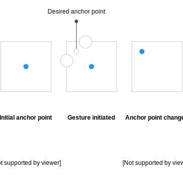

# ChangeAnchorPoint

|  | Android | Apple | Web |
| --- | --- | --- | --- |
| Milestone | [Milestone](https://github.com/material-motion/material-motion-family-direct-manipulation-android/milestone/1) | [Milestone](https://github.com/material-motion/material-motion-family-gestures-swift/milestone/1) | &nbsp; |

## Overview

Change the anchor point of a target.

## Contract

The anchor point of the view is immediately changed to the `newAnchorPoint`. The target's position is also updated to avoid noticeable movement of the target.

```
Plan ChangeAnchorPoint {
  Position newAnchorPoint
}
```

`newAnchorPoint` should be relative to the target's dimensions. E.g. an anchor point of 0,0 means the corner of the target should be the new anchor point.

## Performer considerations

The following diagram shows the desired effect of changing the anchor point of an element:



In pseudo-code:

```
func onGestureInitiated() {
  let initialPositionInElement = Point(element.anchorPoint.x * element.width,
                                       element.anchorPoint.x * element.height)

  let gesturePositionInElement = gesture.positionInElement(element)
  let desiredAnchorPoint = Point(gesturePositionInElement.x / element.width,
                                 gesturePositionInElement.y / height)

  element.anchorPoint = desiredAnchorPoint
  element.position += gesturePositionInElement - originalPositionInElement
}
```
