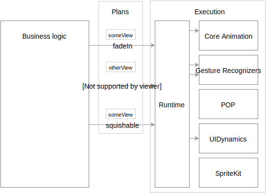
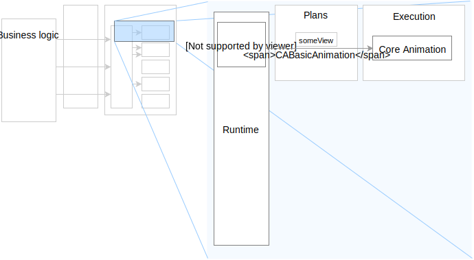
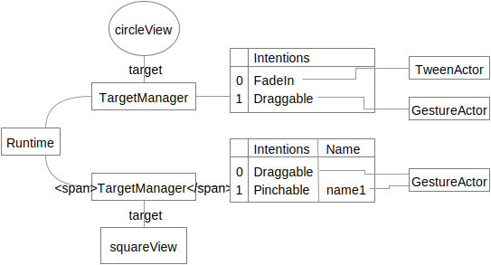

Status of this document: **Draft**

# Motion Runtime

The system we propose here emphasizes a separation of plan from its execution. We call it a Motion Runtime.

New terminology: Transaction, Intention, and Actor.

## Purpose

The purpose of a Motion Runtime is to coordinate the expression of diverse types of motion and interaction. It is an abstraction layer between the application engineer and any number of fulfillment systems.

The following diagram shows where the Motion Runtime lives in relation to a platform like iOS.

Let's zoom in to the Motion Runtime for a moment. Core Animation is simply another form of plan/execution system. This composition allows the Motion Runtime to translate plans into the best possible execution.

## Overview

A Motion Runtime relies on objects called Intentions. Intentions define an abstract plan of motion.

Runtimes create Actor instances that are capable of fulfilling the provided Intentions.

## Intention

An Intention instance represents a plan of motion.

**Example objects**:

- `SquashAndStretch` causes a target to squash and stretch in the direction of its movement.
- `Tween` could also be a type of Intention.
- `Draggable` represents a gestural intention.
- `AnchoredSpring` represents a spring anchored to a location.

**Configuration**: Intentions can have configurable properties.

## Commit Intentions

Intentions are committed to Motion Runtimes via Transactions.

A Transaction's public API should support the following operations:

- Associate an Intention with a target.
- Associate a named Intention with a target.
- Remove any Intention associated with a given name from a target.

It must be possible to enumerate the operations of a Transaction.

The log's order must match the order of operation requests.

A Transaction needs to be committed to a Motion Runtime for it to take effect; e.g. `Motion Runtime.commit(transaction)`.

Consider the following transaction pseudo-code:

    transaction = Transaction()
    transaction.add(FadeIn, circleView)
    transaction.add(Draggable, squareView)
    transaction.addNamed("name1", Pinchable, squareView)
    transaction.addNamed("name2", Rotatable, squareView)
    transaction.removeNamed("name2", squareView)
    transaction.add(Draggable, circleView)
    Motion Runtime.commit(transaction)

The Transaction's log might resemble the following pseudo-object:

    > transaction.log
    [
      {action:"add", intention: FadeIn, target: circleView},
      {action:"add", intention: Draggable, target: squareView},
      {action:"addNamed", intention: Pinchable, name: "name1", target: squareView},
      {action:"addNamed", intention: Rotatable, name: "name2", target: squareView},
      {action:"remove", name: "name2", target: squareView}
      {action:"add", intention: Draggable, target: circleView},
    ]

After committing the above transaction, the Motion Runtime's internal state might resemble the following:

Note that `Rotatable` is not listed. This is because we also removed any Intention named "name2" in this Transaction.

The Motion Runtime is now expected to fulfill its Intentions.

## Fulfill Intentions

The Motion Runtime we propose uses entities called **Actors** to fulfill specific types of Intention. The Actor is the specialized mediating agent between Intention and its fulfillment.

### Intention ↔ Actor association

We'll assume a function exists that returns an Actor capable of fulfilling a type of Intention. The method signature for this method might look like this:

    function actorForIntention(intention, target, existingActors) -> Actor

This function will use a `Intention type → Actor type` lookup table. The lookup can be implemented in many ways:

**Intention → Actor**

Intentions define the Actor they require. This requires Intentions to be aware of their Actors, which is not ideal. It does, however, avoid a class of problems that exist if Actors can define which Intentions they fulfill.

**Actor → Intention**

Actors define which Intentions they can fulfill. This approach allows Intentions to be less intelligent. It introduces the possibility of Actors conflicting on a given Intention.

### On commit: generate Actors

When a Transaction is committed, the Motion Runtime must generate an Actor for each Intention in the Transaction. Consider the Transaction log we'd explored above:

    > transaction.log
    [
      {action:"add", intention: FadeIn, target: circleView},
      {action:"add", intention: Draggable, target: squareView},
      {action:"addNamed", intention: Pinchable, name: "name1", target: squareView},
      {action:"addNamed", intention: Rotatable, name: "name2", target: squareView},
      {action:"remove", intention: "name2", target: squareView}
    ]

Recall that the above log translated to the following internal state:

Let's create Actors by calling our hypothetical `actorForIntention` on each target's Intentions.

We've created three Actors in total. `circleView` has two Actors. `squareView` has one. We've also introduced a question to the reader: "Why is there only one gesture Actor for the squareView?"

#### One Actor instance per type of Intention

A single Actor instance is created for each *type* of Intention registered to a target. This allows Actors to maintain coherent state even when multiple Intentions are concerned.

Consider the following pseudo-Transaction involving physical simulation Intentions:

    transaction = Transaction()
    transaction.add(Friction.on(position), circleView)
    transaction.add(AnchoredSpring.on(position), circleView)
    Motion Runtime.commit(transaction)

Our circleView now has two Intentions and one Actor, a PhysicalSimulationActor. Both Intentions are provided to the Actor instance.

The Actor now knows the following:

- It has two Forces, both affecting `position`.
- It needs to model `velocity` for the `position`.

The Actor now creates some state that will track the position's velocity.

The Actor can now:

1. convert each Intention into a physics force,
2. apply the force to the velocity, and
3. apply the velocity to the position

on every frame.

Alternatively, consider how this situation would have played out if we had one Actor per Intention. There would now be two representations of `velocity` for the same `position`. On each frame, one Actor would "lose". The result would be a confusing animation.

Note that "one Actor per type of Intention" does not resolve the problem of sharing state across different types of Intentions. This is an open problem.

### Repeated: forward animation events to Actors

The Motion Runtime is now expected to forward animation events to the Actor instances.

Actors are informed of events via the following pseudo-algorithm:

    for every target
      for every actor
        actor.event()

Some Actors are not interested in animation events. Do not inform these Actors of animation events. If no Actor requires animation events, then the Motion Runtime should not listen to animation events.

### Motion Runtime active vs idle state

At any given time a Motion Runtime can either be **idle** or **active**.

A Motion Runtime is active when there is at least one active Actor. 

An Actor can be active for any of the following reasons:

- The animate event returned a Boolean value of true. True indicates that the Actor expects to perform more work on the next animate event.
- The Actor has indicated some form of active **external activity**.

### External activity

Actors often depend on external systems to fulfill their Intentions. An Actor is therefor responsible for informing the Motion Runtime of two events:

- When external activity begins.
- When external activity ends.

The Motion Runtime might provide Actors with two function instances:

    var startActivity = function(name)
    var endActivity = function(name)

When an Actor calls these methods, the provided name should be scoped to the Actor instance, not globally to the Motion Runtime.

For example, an Actor might have a gesture handler that looks like this:

    function handleGesture(gesture) {
      switch (gesture.state) {
      case .Began:
        startActivity("gesture")
      case .Canceled:
      case .Ended:
        endActivity("gesture")
      }
    }

Similarly, an Actor might implement the following when working with an external animation system:

    function setup() {
      startActivity("animation")
      target.doAnimation(parameters, completion: {
        endActivity("animation")
      })
    }

### Open topics

The following topics are open for discussion. They do not presently have a clear recommendation.

- When should Actors be removed from a Motion Runtime?

<!--

LGTM:
- featherless

-->
