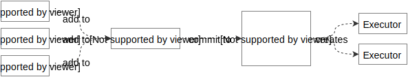

# Motion Runtime

This section defines a system that emphasizes the separation of a plan from its execution. We call it a Motion Runtime, or Runtime for short.

A Runtime serves two primary purposes:

- Provide an abstraction layer between the application engineer and execution systems.
- Coordinate the expression of diverse types of motion and interaction.

The following diagram shows where the Runtime lives in relation to a platform like iOS.

## Overview

A Runtime will find a way to execute any plans it is provided.

This sentence introduces two important questions:

1. How are plans provided to a Runtime?
1. How does a Runtime know how to execute plans?

To answer the first question we introduce two new types into the system: the **_Plan_** and the **_Transaction_**.

> A Plan is an object representing **what you want something to do**. A Transaction aggregates requests for Plan-target associations.

To answer the second question we introduce one more type: the **_Executor_**.

> An Executor's sole responsibility is to fulfill the contract defined by one or more Plans.

Here's how these objects fit together:

1. Plans are added to Transactions.
2. Transactions are committed to Runtimes.
3. Runtimes create Executors.

In visual form:

Learn more about these relationships by reading [Life of a Plan](life_of_a_plan.md).

Or dive in to the engineering specifications:

- [Runtime](runtime.md)
- [Plan](plan.md)
- [Transaction](transaction.md)
- [Executor](executor.md)

Collectively, these objects represent what we consider to be a *minimum-viable motion runtime*.

<!--

LGTM:
- appsforartists
- featherless
- markwei

-->
