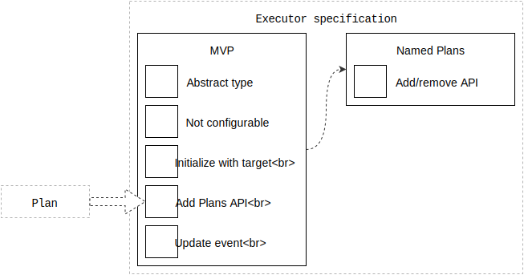

# Executor specification

This is the engineering specification for the Executor abstract type.

Executors are the objects responsible for executing Plans.

Printable tech tree/checklist:

---

<tt>MVP</tt>

**Abstract type**: An Executor is an abstract protocol or interface, if your language allows.

Example pseudo-code:

    protocol Executor {
    }

**Not configurable**: Executors do not provide direct configuration methods.

Executors can only be configured by providing them with Plans.

**Initialize with target**: Executors are initialized with a target.

Example pseudo-code:

    executor = Executor(target)

**Add plans API**: Plans are provided to Executors.

>The Executor may choose not to implement this API.

Example pseudo-code:

    protocol PlanExecution {
      function addPlan(plan)
    }

Example pseudo-code from within the Runtime:

    executor = executorForPlan(plan, target)
    if executor.addPlan {
      executor.addPlan(plan)
    }

**Update API**: Executors can implement an update function.

>The Executor may choose not to implement this API.

The update function will be called many times per second. The Executor may use this method to perform time-based calculations.

The method returns an activity state enumeration. This enumeration has two states: active and idle.

Example pseudo-code:

    enum ActivityState {
      .Active
      .Idle
    }
    
    protocol UpdateExecution {
      function update() -> ActivityState
    }

<tt>/MVP</tt>

---

<tt>feature: Named plans</tt>

Executors can receive named Plans.

**Add/remove API**: Executors can implement an add/remove function.

>The Executor may choose not to implement this API.

If one method is implemented, so must the other.

Example pseudo-code:

    protocol NamedPlanExecution {
      function addPlanWithName(plan, name)
      function removePlanWithName(name)
    }

<tt>/feature: Named plans</tt>

---

<tt>feature: Remote execution</tt>

Executors can delegate work to a remote API such as a platform-native API.

**Remote execution API**: Executor can invoke callbacks when remote execution starts and ends.

>The Executor may choose not to implement this API.

The Executor would be responsible for informing the Runtime of two things: when remote execution will start, and when remote execution has ended.

Example pseudo-code:

    protocol RemoteExecution {
      function setRemoteExecutionCallback(callback)
    }
    
    class RemoteExecutionCallback {
      function onRemoteExecutionStart(executor, name)
      function onRemoteExecutionEnd(executor, name)
    }

<tt>/feature: Remote execution</tt>

---
