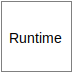
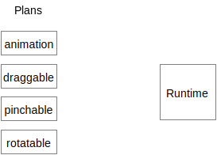
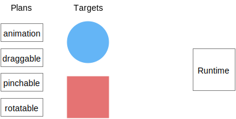
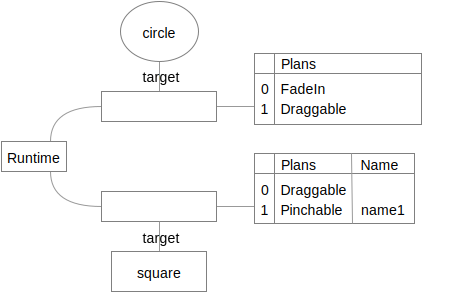

## Life of a plan

Let's walk through the life of a plan.

> Note: any code you see here is pseudo-code.

### Step 1: Create a scheduler

Schedulers are cheap and easy to create. Many schedulers may exist in an application. Let's create one. We will make use of this object later.

```
scheduler = Scheduler()
```



### Step 2: Create plans

All motion in a runtime begins with a plan. Let's create four different types of plan:

```
animation = Tween()
animation.property = "opacity"
animation.from = 0
animation.to = 1

draggable = Draggable()
pinchable = Pinchable()
rotatable = Rotatable()
```



### Step 3: Add the plans to the scheduler

Let's say we have two targets - a circle and a square - to which we want to associate our plans.



Plans are associated to targets:

```
scheduler.addPlan(animation, to: circleView)
scheduler.addPlan(draggable, to: squareView)
scheduler.addPlan(pinchable, named: "name1", to: squareView)
scheduler.addPlan(rotatable, named: "name2", to: squareView)
scheduler.removePlan(named: "name2", from: squareView)
scheduler.addPlan(draggable, to: circleView)
```

After executing the above code, the scheduler's internal state might resemble this:



> Note that `Rotatable` is not listed. This is because we also removed any plan named "name2" in this transaction.

The scheduler is now expected to fulfill the committed plans.

### Step 4: Scheduler creates performers

The scheduler uses entities called **performers** to execute its plans. A performer is a specialized mediating agent between a plan and its fulfillment.

We'll assume a function exists that returns a performer capable of executing a type of plan. The method signature for this method might look like this:

```
function performerForPlan(Plan, target, existingPerformers) -> Performer
```

Recall the transaction log we'd explored above:

```
> transaction.log
[
  {action:'add",    target: circleView, plan: FadeIn                  },
  {action:'add",    target: squareView, plan: Draggable               },
  {action:'add",    target: squareView, plan: Pinchable, name: "name1"},
  {action:'add",    target: squareView, plan: Rotatable, name: "name2"},
  {action:'remove", target: squareView,                  name: "name2"},
  {action:'add",    target: circleView, plan: Draggable               },
]
```

Recall that when we committed this transaction to the scheduler our scheduler had the following representation of the committed plans:


The scheduler now creates performers by calling our hypothetical `performerForPlan` on each target's plans.


We've created three performers in total. `circleView` has two performers. `squareView` has one.

> Why is there only one gesture performer for the squareView?
> 
> A single performer instance is created for each _type_ of plan registered to a target. This allows performers to maintain coherent state even when multiple plans have been committed.

### Step 5: Provide plans to performers

The scheduler now provides each plan instance to the relevant performer. This allows each performer to translate plans in to actionable logic.

### Step 6: Performers execute plans

A performer is expected to fulfill the contract defined by its plan. Performers can fulfill their contract in two ways: delegation and composition.

A performer that delegates its execution will

1. Acquire a token indicating that delegated work will start.
2. Initiate the delegated work.
3. Release the token upon completion of the delegated work.

A performer that composes its execution will emit new plans. These new plans may create performers that emit new plans. Eventually the plans will create performers that delegate their execution.
