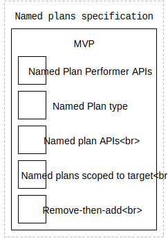

# Named plans feature specification

This is the engineering specification for **named plans**. This specification requires the Transaction, Performer, Plan, and Scheduler types.

|     | Android | Apple | Web |
|:----|:--------|:------|:----|
| First introduced | &nbsp; | [Runtime 4.0.0](https://github.com/material-motion/material-motion-runtime-objc/releases/tag/v4.0.0) | &nbsp; |
| MVP milestones | [Milestone](https://github.com/material-motion/material-motion-runtime-android/milestone/5) | Released | &nbsp; |

## Overview

This feature enables the registration of _named plans_ to a scheduler. Named plans can be added and removed by name, enabling fine configuration of a performer's behavior.

> A named plan cannot have `null` or an empty string as its name.

Printable tech tree\/checklist:



Example use case: associating a behavior with a target.

Example pseudo-code:

```
# on drag
scheduler.addPlan(matchLocationOf(cursor), named: "drag", to: target)

# on release
scheduler.addPlan(springToLocation(origin), named: "drag", to: target)
```

Example use case: removing a behavior from a target.

Example pseudo-code:

```
scheduler.addPlan(springToLocation(origin), named: 'spring', to: target)

# later on
scheduler.removePlan(named: 'spring', from: target)
```

## Performer specification

Performers can receive named plans.

**Add\/remove API**: Performers can implement an add\/remove function.

> Performers may choose not to implement this API.

If one method is implemented, the other must be implemented as well.

Example pseudo-code:

```
protocol NamedPlanPerforming {
  function addPlan(NamedPlan, named: String)
  function removePlan(named: String)
}
```

**NamedPlan type**: Provide a NamedPlan type.

Plans must conform to the NamedPlan type in order to indicate that they support being registered as named plans to a transaction.

# Scheduler specification

Schedulers support named plans. Named plans are plans with a name associated via the transaction.

**Named APIs**: Provide an `addPlan` and `removePlan` API with a name argument.

Note that the plan type must be a `NamedPlan`. Motion family designers use this type to indicate which plans support being named.

Example pseudo-code:

```
class Scheduler {
  function addPlan(NamedPlan, named: String, to: Target)
  function removePlan(named: String, from: Target)
}

# Associate a named plan with a target.
scheduler.addPlan(plan, named: name, to: target)

# Remove any named plan from a target.
scheduler.removePlan(named: name, from: target)
```

**Target-scoped names**: Names are scoped to a target.

The scheduler maintains a separate named plan mapping for each target.

**Remove-then-add**: Two things happen when a named plan is added.

1. Remove any previously committed plan with the same name from the target's performers.

  _Note:_ This may be on a different performer instance on the same target. In the example above perhaps a PhysicsPerformer is needed for the second transaction, but not for the first.

2. Provide the relevant performer with the new named plan.

Example pseudo-code:

```
# Step 1
performerForName(name).removePlan(named: name)

# Step 2
performer = performerForPlan(plan)
performer.add(plan: plan, withName: name)
performerForName(name) == performer 
> true
```

**API contract**: Here are the Performer's expectations for this API.

*Removing a name which was never added before:*

```
Scheduler scheduler = new Scheduler();
scheduler.removeNamedPlan("foo");
```
 
* Nothing happens. No performer is created.

*Adding a name which was never added before:*

```
Scheduler scheduler = new Scheduler();
scheduler.addNamedPlan(plan, "foo");
```

* A performer is created for plan. 
* The performer's `addNamedPlan(plan, "foo")` is called.

*Adding a name which was added before:*

```
Scheduler scheduler = new Scheduler();
scheduler.addNamedPlan(plan, "foo");
scheduler.addNamedPlan(plan2, "foo");
```

* A performer is created for plan. 
* The performer's `addNamedPlan(plan, "foo")` is called.
* The performer's `removeNamedPlan("foo")` is called.
* The performer's `addNamedPlan(plan2, "foo")` is called.

