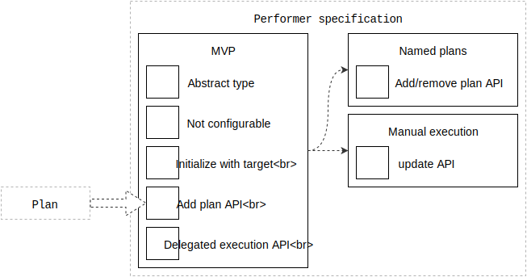

# Performer specification

This is the engineering specification for the `Performer` abstract type.

|                  | Android | Apple |
| ---------------- |:-------:|:-----:|
| First introduced | [Runtime 1.0.0](https://github.com/material-motion/material-motion-runtime-android/releases)   | [Runtime 1.0.0](https://github.com/material-motion/material-motion-runtime-objc/releases/tag/v1.0.0) |
| Technical guide | <a href="https://github.com/material-motion/material-motion-runtime-objc/blob/develop/guides/Life%20of%20a%20plan%20(objc).md">Life of a plan</a>   | &nbsp; |

## Features

- [Named plans](named-plans.md)
- [Composition](performer-composition.md)

## Overview

Performers are the objects responsible for executing plans.

Printable tech tree/checklist:

## MVP

**Abstract type**: `Performer` is a protocol, if your language has that concept.

Example pseudo-code:

    protocol Performer {
    }

**Not directly configurable**: Performers do not provide direct configuration methods.

Performers can only be configured by providing them with plans.

**Initialize with target**: Performers are initialized with a target.

Example pseudo-code:

    performer = Performer(target)

**Add plan API**: Define an optional API that allows performers to receive plans.

> If a performer cannot be configured, it will not expose this API.

Example pseudo-code:

    protocol PlanPerforming {
      function addPlan(plan)
    }

**Delegated execution API**: Define an optional API that allows performers to delegate their work to an external system, like Web Animations or CoreAnimation.

> The performer may choose not to implement this API.

The performer would be responsible for informing of two things: when delegated execution will start, and when delegated execution has ended.

Example pseudo-code:

    protocol DelegatingPerformer {
      function setDelegatedExecutionCallback(callback)
    }
    
    class DelegatedExecutionCallback {
      function delegatedExecutionWillStart(performer) -> DelegatedPerformanceToken
      function delegatedExecutionDidFinish(performer, token)
    }

The performer must implement a method that receives two functions. Invoking the first function indicates that some unit of delegated work will begin. This function returns a token. The second function must be invoked once the delegated work has completed. Provide the token returned by the first function to the second function.

---

## Proposed features

### Manual execution

A performer can choose to implement an update function that will be called many times per second.

**Manual execution API**: Define an optional API that allows performers to implement an update function.

> The performer may choose not to implement this API.

The update function will be called each time the platform will draw a new frame. The performer may use this method to perform time-based calculations. The performer is **not** expected to perform any rendering during this update event.

The method returns an activity state enumeration. This enumeration has two states: active and at rest.

Example pseudo-code:

    enum ActivityState {
      .Active
      .AtRest
    }
    
    protocol ManuallyExecutingPerformer {
      function update(millisecondsSinceLastUpdate) -> ActivityState
    }
