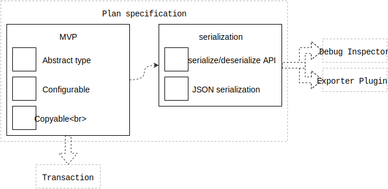

# Plan specification

This is the engineering specification for the `Plan` abstract type.

|                  | Android | Apple |
| ---------------- |:-------:|:-----:|
| First introduced | [Runtime 1.0.0](https://github.com/material-motion/material-motion-runtime-android/releases)   | [Runtime 1.0.0](https://github.com/material-motion/material-motion-runtime-objc/releases/tag/v1.0.0) |
| Technical guide | <a href="https://github.com/material-motion/material-motion-runtime-objc/blob/develop/guides/Life%20of%20a%20plan%20(objc).md">Life of a plan</a>   | &nbsp; |

## Features

- [Serialization](../serialization.md)

## Overview

A plan is an object representing **what you want something to do** or **how you want it to behave**.

Example plan objects:

- `SquashAndStretch` describes a target squashing and stretching in the direction of its movement.
- `Tween` describes a tween animation.
- `Draggable` describes gestural translation.
- `AnchoredSpring` describes a physical simulation.

Printable tech tree/checklist:

## MVP

**Abstract type**: `Plan` is a protocol, if your language has that concept.

Pseudo-code example:

    protocol Plan {
    }

**Performer type API**: Provide an API that returns an instantiable type of performer that can execute this plan.

Pseudo-code example:

    protocol Plan {
      var performerType
    }

**Copyable**: Plans can be copied.

Modifications made to the copy do not affect the original.

This can be implemented in a variety of ways. We've included a few options below:

- Immutable types.
- Value types.
- Implement a copy or clone method on a reference type.
