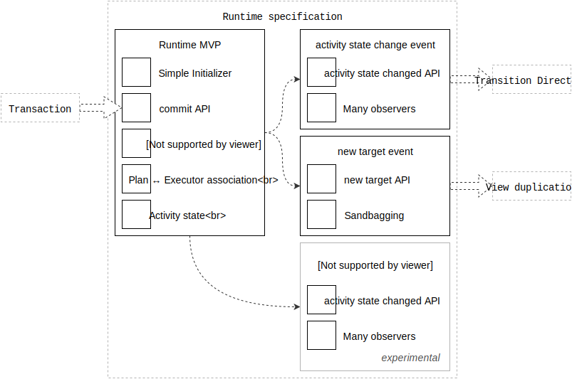
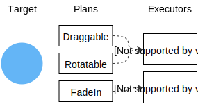

# Runtime specification

This is the engineering specification for the Runtime object.

Printable tech tree/checklist:

---

<tt>MVP</tt>

**Simple initializer**: A Runtime is cheap to create.

Example pseudo-code:

    runtime = Runtime()

**commit API**: Provide an API to commit Transactions to a Runtime.

Example pseudo-code:

    runtime.commit(transaction)

Requires: [Transaction](transaction.md)

**One instance of an Executor type per target**: Create One Executor instance for each *type* of Executor required by a target. This allows multiple Plans to affect a single Executor instance. The Executors can then maintain state across multiple Plans.

> Consider the following pseudo-code transaction involving physical simulation:
> 
>     transaction = Transaction()
>     transaction.add(Friction(), circleView)
>     transaction.add(AnchoredSpringAtLocation(x, y), circleView)
>     runtime.commit(transaction)
> 
> `circleView` now has two Plans and one Executor, a PhysicalSimulationExecutor. Both Plans are provided to the Executor instance.
> 
> The Executor knows the following:
> 
> - It has two forces, both affecting `position`.
> - It needs to model `velocity` for the `position`.
> 
> The Executor creates some state that will track the position's velocity.
> 
> The Executor can now:
> 
> 1. convert each Plan into a physics force,
> 2. apply the force to the velocity, and
> 3. apply the velocity to the position

> on every frame.
> 
> Alternatively, consider how this situation would have played out if we had one Executor for every Plan. There would now be two conflicting representations of `velocity` for the same `position`. On each frame, one Executor would "lose". The result would be a confusing animation.

Note that "one Executor per type of Plan" does not resolve the problem of sharing state across different types of Plans. This is an open problem.

**Plan ↔ Executor association**: The Runtime must be able to translate Plans into Executors.

This lookup can be implemented in many ways:

- Plans define their Executor type

Plans define the Executor they require. This requires Plans to be aware of their Executors, which is not ideal. It does, however, avoid a class of problems that exist if Executors can define which Plans they fulfill.

Example pseudo-code:

    class SomePlan {
      function executorType() {
        return SomeExecutor.type
      }
    }
    
    # In the Runtime...
    executorType = plan.executorType()
    executor = executorType()

> This is the preferred approach.

- Map Executor type to Plan type with look-up table

Executors define which Plans they can fulfill. This approach allows Plans to be less intelligent. But it introduces the possibility of Executors conflicting on a given Plan.

Example pseudo-code:

    # In some initialization step...
    runtime.executorType(SomeExecutor.type, canExecutePlanType: SomePlan.type)
    
    # In the Runtime...
    executorType = plan.executorTypeForPlan(plan)
    executor = executorType()

**Activity state**: Activity state is one of either active or idle. The Runtime must provide a read-only API for accessing this state.

Pseudo-code example:

    enum RuntimeActivityState {
      .Active
      .Idle
    }
    
    Runtime {
      function activityState() -> RuntimeActivityState
    }

A Runtime is active if any of its Executor instances are active. An Executor is active if either of the following conditions are met:

- The Executor has an active remote execution.
- The Executor returned `true` from its last update event.

<tt>/MVP</tt>

---

<tt>feature: activity state change event</tt>

Fire an observable event when the idle/active state changes.

Unlocks [Transition Directors](../transition_directors.md).

**activity state changed API**: Provide a mechanism for listening to activity state changes.

    Runtime {
      function addActivityStateObserver(function)
    }
    
    runtime.addActivityStateObserver(function(newState) {
      // React to state change
    })

**Many observers**: Allow many observers to be registered.

<tt>/feature: activity state change event</tt>

---

<tt>feature: new target event</tt>

Fire an observable event when a new target is referenced.

Unlocks [view duplication](../view_duplication.md).

**new target API**: Provide a mechanism for listening to new target references.

    Runtime {
      function addNewTargetObserver(function)
    }
    
    runtime.addNewTargetObserver(function(target) {
      // Potentially clone the target
      return clonedTarget
    })

**Sandbagging**: Allow the event receiver to return a new sandbag instance.

A sandbag instance is an instance created on demand to be used in place of the original target.

One common implementation of sandbagging is "view duplication". In this implementation, a visual duplicate of the view is created. This duplicate view can be modified with little consequence.

Executors are expected to act on the sandbag instance rather than the original target.

<tt>/feature: new target event</tt>

---

## Experimental ideas

**Event: target activity state did change**: Any time a specific target changes its idle/active state it should fire an observable event.

This is a more focused event than the "Runtime activity state did change".

This event enables reactionary Plans, i.e. registering new Plans once a Target has entered an idle state.

    Transaction {
      function addActivityStateObserverForTarget(target, function)
    }
    
    transaction.addActivityStateObserverForTarget(target, function(newState) {
      // Start a new transaction and commit it to the Runtime...
    })

NOTE: It may be more valuable to have Executor-level idling. Target-level idling may not be helpful. It's unclear how Executor-level idling would work, given that the outside system should generally be unaware of Executors.

    Transaction {
      function addActivityStateObserverForPlan(plan, function)
    }
    
    transaction.addActivityStateObserverForPlan(plan, function(newState) {
      // Start a new transaction and commit it to the Runtime...
    })

---

## Open topics

The following topics are open for discussion. They do not presently have a clear recommendation.

- When should Executors be removed from a Runtime?
- Should Runtimes support target-less Plans?