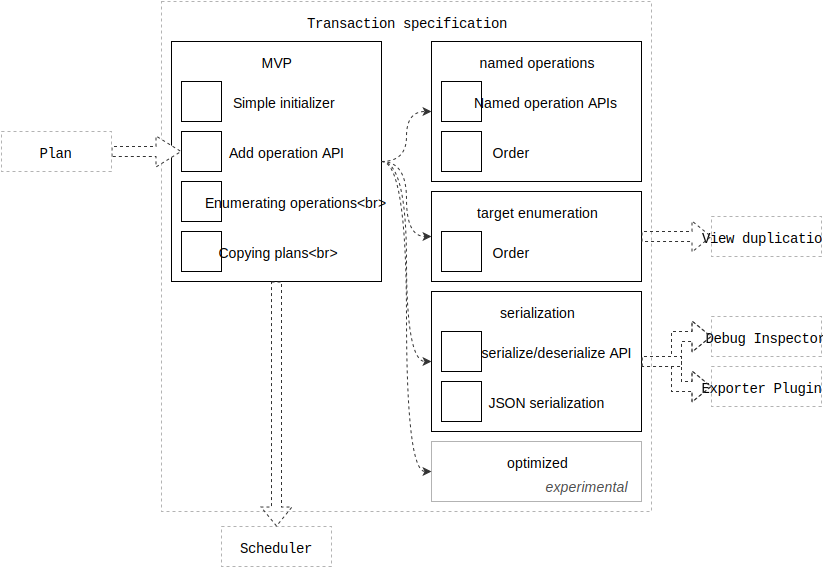

# Transaction specification

This is the engineering specification for the Transaction object.

Transactions aggregate requests for Plan-target associations. Transactions are designed to be committed to a Runtime.

Printable tech tree/checklist:

---

<tt>MVP</tt>

**Simple initializer**: A Transaction is cheap to create.

Example pseudo-code:

    transaction = Transaction()

**Add operation**: Transactions support a basic add operation.

> Note: the function names included below are not prescriptive. Choose appropriate names for your language/platform conventions.

Example pseudo-code:

    # Associate a Plan with a target.
    transaction.add(plan, target)

**Enumerating operations**: Operations recorded to a transaction are enumerable.

Operations are enumerated in the order in which they were recorded.

**Enumerating targets**: Targets referenced in a transaction are enumerable.

Targets are enumerated in the order in which they were first referenced.

Example pseudo-code:

    > transaction.targets
    [
      circleView,
      squareView
    ]

**Copying Plans**: When a Plan is added to a transaction it must be copied. This ensures that subsequent modifications to the Plan object do not "sneak" in to the transaction. For example:

Example pseudo-code:

    plan.fromValue = 0
    transaction.add(plan, target)
    
    plan.fromValue = 5
    transaction.add(plan, target)

The transaction's log must look like so:

    [add(plan (fromValue = 0), add(plan (fromValue = 5)]

Note that the first plan's `fromValue` did not magically transform into `5`.

<tt>/MVP</tt>

---

<tt>feature: named operations</tt>

Transactions support named add/remove operations.

**Named operations API**: Provide an API for add and remove with a name argument.

Example pseudo-code:

    # Associate a named Plan with a target.
    transaction.add(plan, name, target)
    
    # Remove any named Plan from a target.
    transaction.remove(name, target)

**Order**: Operation order also matters for named operations.

Store named operations in the same log as unnamed operations.

<tt>/feature: named operations</tt>

---

<tt>feature: serialization</tt>

Transactions are serializable.

Serializable transactions can be sent over a wire or recorded to disk.

Requires: Serializable Plans.

**serialize/deserialize API**: Provide APIs for serializing and deserializing a Transaction.

Example pseudo-code:

    # Serialize the transaction
    json = transaction.serialize()
    
    # Create a new Transaction from json
    transaction = Transaction(json)

**JSON serialization**: A serialized Transaction is represented in JSON.

<tt>/feature: serialization</tt>

---

<tt>feature: optimized</tt>

Transactions optimize their operations.

TODO: Spec this out.

<tt>/feature: optimized</tt>

