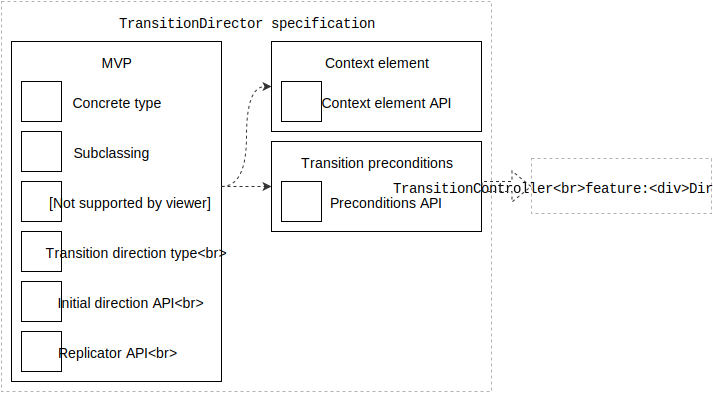

# TransitionDirector specification

This is the engineering specification for the `TransitionDirector` object.

## Overview

A `TransitionDirector` provides essential scaffolding for managing a transition.

`TransitionDirector` conforms to the `Director` protocol.

Printable tech tree/checklist:



## Features

* [Context element](feature-context-element.md)
* [Transition preconditions](feature-transition-preconditions.md)

## MVP

**Concrete type**: A `TransitionDirector` is a concrete type that adheres to the informal Director APIs.

Example pseudo-code:

```
TransitionDirector {
  function setUp()
}
```

**Subclassing**: This class is designed to be subclassed.

The sub-class is expected to implement the functions specified in the `Director` protocol.

Example pseudo-code:

```
MyTransitionDirector: TransitionDirector {
  function setUp() {
    // Perform set up operations
  }
}
```

**fore/back APIs**: Provide storage for information relevant to the transition.

Example pseudo-code:

```
MyTransitionDirector: TransitionDirector {
  public var foreViewController
  public var backViewController
  public var transitionDirection: TransitionDirection
}
```

**TransitionDirection type**: Provide a `TransitionDirection` type with two opposite values.

Example pseudo-code:

```
enum TransitionDirection {
  case forward
  case backward
}
```

**Initial transition direction API**: Transition directors have a read-only `initialTransitionDirection` API.

Provide the initial transition direction of the transition to the director's initializer.

Example pseudo-code:

```
TransitionDirector {
  readonly var initialTransitionDirection: TransitionDirection
  init(initialTransitionDirection)
}
```

**ReplicaController API**: Transition directors have a private read-only `replicaController` API.

Provide the replica controller to the director's initializer.

This API is not accessible to sub-classes.

Example pseudo-code:

```
TransitionDirector {
  private readonly var replicaController
  init(replicaController)
}
```

**ReplicaControllerDelegate API**: Transition directors can assign a `replicaControllerDelegate`.

Subclasses are expected to set a custom replica controller delegate using this API.

Example pseudo-code:

```
TransitionDirector {
  var replicaControllerDelegate
}
```

## Open Questions

* How might we avoid subclassing this type?
* Should we provide `TransitionDirector` with a timeline?
* How does the `TransitionDirector` change the direction of the transition?

