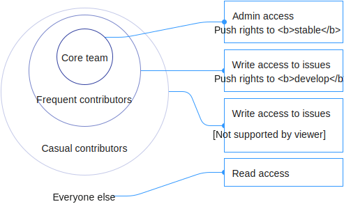

# Governance

The Material Motion [Starmap](https://material-motion.gitbooks.io/material-motion-starmap/content/) and its implementations represent a collaborative effort lead by a core group of contributors. The core contributors represent diverse backgrounds across many platforms and languages. The initial core contributors are all Googlers.

## Roles

We use GitHub teams to define specific roles for the material-motion organization.

`core-team`

- Admin access to every material-motion repo.
- Push rights for `stable`.
- All rights below.

`*-frequent-contributors`: [frequent contributor teams](https://github.com/orgs/material-motion/teams?utf8=%E2%9C%93&query=frequent%20contributors)

- Write access to specific platform repos.
- Push rights for `develop`.
- All rights below.

`*-casual-contributors`: [casual contributors teams](https://github.com/orgs/material-motion/teams?utf8=%E2%9C%93&query=casual%20contributors)

- Write access to specific platform repos.
- Can push new branches.
- Can label issues.
- All rights below.

`everyone else`

- Read access to any repo.
- Fork a repo to suggest changes via Pull Request.
- Can file issues.

## Accepting contributions

We use the following rules for accepting contributions.

1. We require that all contributors sign [Google's Contributor License Agreement](https://cla.developers.google.com/).

1. All contributions must be approved by a member of the [core contributors team](https://github.com/orgs/material-motion/teams/core-team).

> Before we can use your code, you must sign the [Google Individual Contributor License Agreement](https://developers.google.com/open-source/cla/individual?csw=1) (CLA), which you can do online. The CLA is necessary mainly because you own the copyright to your changes, even after your contribution becomes part of our codebase, so we need your permission to use and distribute your code. We also need to be sure of various other things—for instance that you'll tell us if you know that your code infringes on other people's patents. You don't have to sign the CLA until after you've submitted your code for review and a member has approved it, but you must do it before we can put your code into our codebase.
> 
> Contributions made by corporations are covered by a different agreement than the one above, the [Software Grant and Corporate Contributor License Agreement](https://cla.developers.google.com/about/google-corporate).

### Core contributors

Each core contributor has a specific focus area.

| GitHub Account | Platform |
|:-------|:------|
| [appsforartists](https://github.com/appsforartists) | JavaScript, Web |
| [featherless](https://github.com/jverkoey) | iOS, macOS, project lead |
| [pingpongboss](https://github.com/pingpongboss) | Android |
