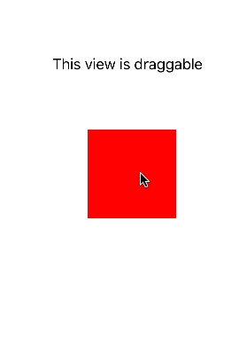

# June 30-July 6, 2016

## Meta

🔇  Our silent open source launch went well! In total we open sourced 22 github repositories, 2 gitbooks, and our code review platform.

🏛  Check out our [team culture and tooling docs](https://material-motion.gitbooks.io/material-motion-team/content/) to learn about how we intend to govern ourselves as an open source community.

## 🌟 Starmap 🗺

[You can now easily read the starmap](https://material-motion.gitbooks.io/material-motion-starmap/content/). No major updates this week.

## Android platform

📝 Tooling being refined. Runtime v1.0.0 in development. [Follow along with our v1.0.0 milestone](https://github.com/material-motion/material-motion-runtime-android/milestone/1).

## Apple platforms

📝 Runtime v1.0.0 prepping to release this week. [Follow along with our v1.0.0 milestone](https://github.com/material-motion/material-motion-runtime-objc/milestone/1).

We built our first MVP of a “Draggable” interaction on iOS.

## Web frameworks

📝 Material Motion Runtime MVP likely landing this week.

## Learn more

Join us on Discord! [discord.gg/ZJyGXza](https://discord.gg/ZJyGXza)
