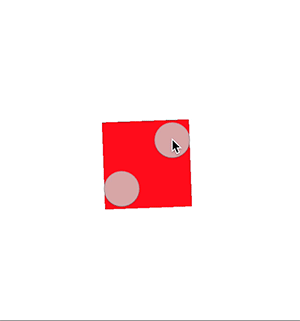

# October 06-12, 2016

This weekly update captures what changed in a given week across the Material Motion ecosystem.

Check out [current focus](current_focus.md) to see what we're working on next.

Check out [stability](stability.md) to learn about the current state of each feature.

## Meta

Team was in NYC for part of the week. Lots of travel + sick made this a shorter week.

## What has changed

Legend:

- 🎉: something launched! Click to view the release notes.
- 📝: something was worked on.

| [Tech stack](https://material-motion.gitbooks.io/material-motion-starmap/content/specifications/#tech-stack)    | Starmap | Apple | Android | Web |
|:-------------:|:-------:|:-----:|:-------:|:---:|
| [Runtime](https://material-motion.gitbooks.io/material-motion-starmap/content/specifications/runtime/)       | &nbsp; | 📝 | &nbsp; | 📝 |
| [Transitions](https://material-motion.gitbooks.io/material-motion-starmap/content/specifications/transitions.html)   | &nbsp; | &nbsp; | &nbsp; | &nbsp; |
| [Interactions](https://material-motion.gitbooks.io/material-motion-starmap/content/specifications/interactions.html)  | &nbsp; | &nbsp; | &nbsp; | &nbsp; |
| [Serialization](https://material-motion.gitbooks.io/material-motion-starmap/content/specifications/serialization.html) | &nbsp; | &nbsp; | &nbsp; | &nbsp; |
| - | - | - | - | - |
| [Motion Family](https://material-motion.gitbooks.io/material-motion-starmap/content/specifications/motion-family.html)       | **Starmap** | **Apple**  | **Android** | **Web**    |
| [Arc move](https://material-motion.gitbooks.io/material-motion-starmap/content/specifications/motion_family/arc_move.html)            | &nbsp; | &nbsp; | &nbsp; | &nbsp; |
| [Direct manipulation](https://material-motion.gitbooks.io/material-motion-starmap/content/specifications/motion_family/direct_manipulation.html) | &nbsp; | 📝 | &nbsp; | &nbsp; |
| [Momentum conservation](https://material-motion.gitbooks.io/material-motion-starmap/content/specifications/motion_family/momentum_conservation.html) | &nbsp; | 📝 | 📝 | &nbsp; |
| [Tween](https://material-motion.gitbooks.io/material-motion-starmap/content/specifications/motion_family/tween.html)               | &nbsp; | 📝 |  📝 | &nbsp; |
| [Timeline tween](https://material-motion.gitbooks.io/material-motion-starmap/content/specifications/motion_family/timeline_tween.html)      | &nbsp; | &nbsp; | &nbsp; | &nbsp; |
| - | - | - | - | - |
| **Catalog** | **Starmap** | **Apple** | **Android** | **Web** |
|  Color interpolation | &nbsp; | &nbsp; |  &nbsp; | &nbsp; |
|  Sparkle Dialog | &nbsp; | &nbsp; |  &nbsp; | &nbsp; |

## Starmap

- 📝 **Transitions** Team discussed and chose back/fore as fixed names for transition sides. These were previously named left/right, respectively.

## Android platform

- 🎉 **Rebound motion family** Landed the MVP.
- 📝 **Tween motion family** MVP in review.

## Apple platforms

- 🎉 **Runtime** Named plans feature landed thanks to [seanoshea](https://github.com/seanoshea). [View the pull request](https://github.com/material-motion/material-motion-runtime-objc/pull/88).
- 🎉 **Runtime** New Tracer APIs. These APIs make it possible to test and visualize the state of the Runtime in real time. [View the spec](https://material-motion.gitbooks.io/material-motion-starmap/content/specifications/runtime/scheduler_tracing.html).
- 🎉 **Core Animation motion family** Introduced Tween type. Progressing towards a [v1.0.0 release](https://github.com/material-motion/material-motion-family-coreanimation-swift/milestone/2).
- 🎉 **Direct manipulation motion family** Now supports anchor point manipulation. Progressing towards a [v1.0.0 release](https://github.com/material-motion/material-motion-family-coreanimation-swift/milestone/2).

- 📝 **POP motion family** Iterating on SpringTo implementation. [View the spec](https://material-motion.gitbooks.io/material-motion-starmap/content/specifications/motion_family/momentum_conservation.html).

## Web frameworks

- 🎉 **Runtime** TypeScript `Scheduler` MVP unit tests landed ([D1711](http://codereview.cc/D1711))
- 📝 **Runtime** TypeScript `Scheduler` MVP nearing completion ([D1700](http://codereview.cc/D1700))
- 🎉 **Unit testing** set up with Karma, Mocha, Chai, Sinon, and Webpack. ([D1706](http://codereview.cc/D1706))

## Learn more

Join us on Discord! [discord.gg/ZJyGXza](https://discord.gg/ZJyGXza)

