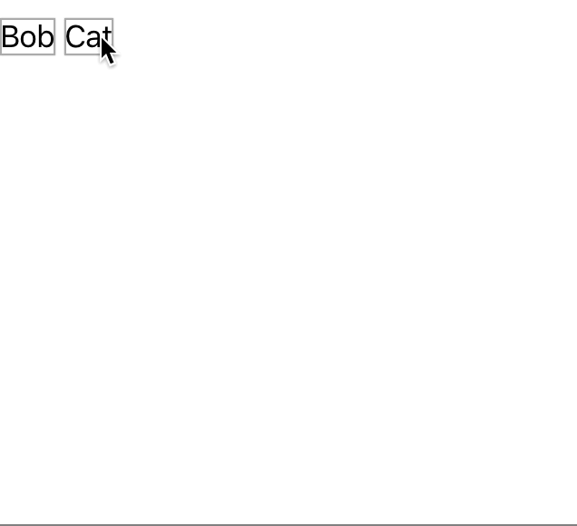

# October 20-26, 2016

This weekly update captures what changed in a given week across the Material Motion ecosystem.

Check out [current focus](current_focus) to see what we're working on next.

Check out [stability](stability) to learn about the current state of each feature.

## Meta

Part of team going through training this week.

## People involved in this sprint

## What has changed

Legend:

- 🎉: something launched! Click to view the release notes.
- 📝: something was worked on.

| [Tech stack](https://material-motion.github.io/material-motion/starmap/specifications/#tech-stack)    | Starmap | Apple | Android | Web |
|:--------------|:-------:|:-----:|:-------:|:---:|
| [Runtime](https://material-motion.github.io/material-motion/starmap/specifications/runtime/)       | &nbsp; | 📝     | [🎉](https://github.com/material-motion/material-motion-runtime-android/releases/tag/3.0.0) | 📝 |
| [Transitions](https://material-motion.github.io/material-motion/starmap/specifications/transitions.html)   | 📝 | 📝 | &nbsp; | &nbsp; |
| [Interactions](https://material-motion.github.io/material-motion/starmap/specifications/interactions.html)  | &nbsp; | &nbsp; | &nbsp; | &nbsp; |
| [Serialization](https://material-motion.github.io/material-motion/starmap/specifications/serialization.html) | &nbsp; | &nbsp; | &nbsp; | &nbsp; |
| - | - | - | - | - |
| [Motion language](https://material-motion.github.io/material-motion/starmap/specifications/motion-family.html)       | **Starmap** | **Apple**  | **Android** | **Web**    |
| [ArcMove](https://material-motion.github.io/material-motion/starmap/specifications/plans/ArcMove.html)             | &nbsp; | &nbsp; | &nbsp; | &nbsp; |
| [ChangeAnchorPoint](https://material-motion.github.io/material-motion/starmap/specifications/plans/ChangeAnchorPoint.html)   | &nbsp; | &nbsp; | &nbsp; | &nbsp; |
| [DirectlyManipulable](https://material-motion.github.io/material-motion/starmap/specifications/plans/DirectlyManipulable.html) | &nbsp; | &nbsp; | &nbsp; | &nbsp; |
| [Draggable](https://material-motion.github.io/material-motion/starmap/specifications/plans/Draggable.html)           | &nbsp; | &nbsp; | &nbsp; | &nbsp; |
| [KeyframeTween](https://material-motion.github.io/material-motion/starmap/specifications/plans/KeyframeTween.html)       | &nbsp; | 📝     | &nbsp; | &nbsp; |
| [Pinchable](https://material-motion.github.io/material-motion/starmap/specifications/plans/Pinchable.html)           | &nbsp; | &nbsp; | &nbsp; | &nbsp; |
| [RemoveSpring](https://material-motion.github.io/material-motion/starmap/specifications/plans/RemoveSpring.html)        | 📝     | &nbsp; |  &nbsp; | &nbsp; |
| [Rotatable](https://material-motion.github.io/material-motion/starmap/specifications/plans/Rotatable.html)           | &nbsp; | &nbsp; | &nbsp; | &nbsp; |
| [ScrollReactor](https://material-motion.github.io/material-motion/starmap/specifications/plans/ScrollReactor.html)       | 📝     | &nbsp; | &nbsp; | &nbsp; |
| [SpringTo](https://material-motion.github.io/material-motion/starmap/specifications/plans/SpringTo.html)            | &nbsp; | &nbsp; | [🎉](https://github.com/material-motion/material-motion-family-rebound-android/releases/tag/1.0.0) | &nbsp; |
| [TweenBetween](https://material-motion.github.io/material-motion/starmap/specifications/plans/TweenBetween.html)        | 📝     | &nbsp; | &nbsp; | &nbsp; |
| [Tween](https://material-motion.github.io/material-motion/starmap/specifications/plans/Tween.html)               | &nbsp; | &nbsp; | 📝 | &nbsp; |
| [VelocitySource](https://material-motion.github.io/material-motion/starmap/specifications/plans/VelocitySource.html)      | 📝     | &nbsp; |  &nbsp; | &nbsp; |
| - | - | - | - | - |
| **Interactions** | **Starmap** | **Apple** | **Android** | **Web** |
|  Color interpolation | &nbsp; | &nbsp; |  &nbsp; | &nbsp; |
|  Sentence builder | &nbsp; | &nbsp; |  &nbsp; | &nbsp; |
|  Sparkle Dialog | &nbsp; | &nbsp; |  &nbsp; | &nbsp; |

## Starmap

📝 **Context Transitions** Drafting spec. [Preview it](https://material-motion.github.io/material-motion/starmap/specifications/context_transitions/). Split the spec into agnostic- vs platform-specific content.

📝 **RemoveSpring** Spec proposal in review. [View the discussions](https://material-motion.github.io/material-motion/starmap/specifications/plans/RemoveSpring.html).

📝 **TweenBetween** Spec proposal in review. [View the discussions](https://material-motion.github.io/material-motion/starmap/specifications/plans/TweenBetween.html).

📝 **VelocitySource** Drafting spec. [Preview it](https://material-motion.github.io/material-motion/starmap/specifications/plans/VelocitySource.html).

## Android platform

📝 **Runtime** Named plans MVP nearing completion. [View the milestone](https://github.com/material-motion/material-motion-runtime-android/milestone/5). Thanks to [seanoshea](https://github.com/seanoshea)!

🎉 **Runtime** Released 3.0.0. [View the release](https://github.com/material-motion/material-motion-runtime-android/releases/tag/3.0.0).

🎉 **Rebound** Released 1.0.0. [View the release](https://github.com/material-motion/material-motion-family-rebound-android/releases/tag/1.0.0).

🎉 **Rebound** 100% test coverage. [View the coverage](https://codecov.io/gh/material-motion/material-motion-family-rebound-android).

📝 **Tween** Released MVP. [View the milestone](https://github.com/material-motion/material-motion-family-tween-android/milestone/1).

🎉 **Travis-CI** Android scaffolding now integrates travis-ci.org into all projects.

🎉 **Codecov** Android scaffolding now integrates codecov.io into all projects.

🎉 **Unit tests** Android scaffolding now supports unit tests for all projects.

## Apple platforms

📝 **KeyframeTween** Implementation landed in material-motion-family-coreanimation-swift. [View the diff](https://github.com/material-motion/material-motion-family-coreanimation-swift/commit/38254f4b7e6c3e1a0a0fd77a3323149e9cb1bbc0).

📝 **Direct manipulation family** Test coverage now near 100%. [View the diff](https://github.com/material-motion/material-motion-family-direct-manipulation-swift/commit/ce18107f293064f1d15f85b29bd5e9704b8ac84a). Thanks to [rcameron](https://github.com/rcameron)!

📝 **Interactions** Prototyping a "tossable word" interaction. [View the WIP diff](http://codereview.cc/D1763).

## Web frameworks
📝 **TypeScript runtime** MVP [landed](https://github.com/material-motion/material-motion-experiments-js/tree/9e1d9281d3d068d1b8284e7e6a7d63e5146d61b2/packages/runtime).  v1.0 release likely next week, pending documentation.

## Learn more

Join us on Discord! [discord.gg/ZJyGXza](https://discord.gg/ZJyGXza)

