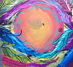
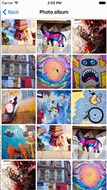

# November 11-November 16, 2016

Want to contribute? Check out our [Android](https://material-motion.github.io/milemarker/index.html?filterby=android) and
[iOS](https://material-motion.github.io/milemarker/index.html?filterby=appleos) milestones, many of
which are ready for someone to take ownership of. Also check out our
[newbie-friendly tasks](https://material-motion.github.io/milemarker/newbie.html?filterby=appleos).

---

This weekly update captures what changed in a given week across the Material Motion ecosystem.

Check out [current focus](https://github.com/orgs/material-motion/projects/4) to see what we're working on next.

Check out [stability](stability) to learn about the current state of each feature.

## Meta

Transitions APIs are nearing feature parity with Odeon (an early version of Material Motion) and
will soon be ready for iOS client team re-integration.  Part of team was at Chrome Dev Summit this week.

## People involved in this sprint

## What has changed

Legend:

- 🎉: something launched! Click to view the release notes.
- 📝: something was worked on.

| [Tech stack](https://material-motion.github.io/material-motion/starmap/specifications/#tech-stack)                        | Starmap | Apple | Android | Web |
|:--------------|:-------:|:-----:|:-------:|:---:|
| [Runtime](https://material-motion.github.io/material-motion/starmap/specifications/runtime/)                              | 📝 | [🎉](https://github.com/material-motion/runtime-objc/releases/tag/v6.0.0) |  | [🎉](https://www.npmjs.org/package/material-motion-runtime/) |
| [Interactions](https://material-motion.github.io/material-motion/starmap/specifications/interactions/)                    |   |   |   |   |
| [Transitions](https://material-motion.github.io/material-motion/starmap/specifications/interactions/transitions/)         | 📝 | 📝 |   |   |
| [Serialization](https://material-motion.github.io/material-motion/starmap/specifications/serialization)                   |   |   |   |   |
| - | - | - | - | - |
| **[Motion language](https://material-motion.github.io/material-motion/starmap/specifications/motion-family)**             | **Starmap** | **Apple**  | **Android** | **Web**    |
| [ArcMove](https://material-motion.github.io/material-motion/starmap/specifications/plans/ArcMove)                         |   |   |   |   |
| [ChangeAnchorPoint](https://material-motion.github.io/material-motion/starmap/specifications/plans/ChangeAnchorPoint)     |   | 📝 |   |   |
| [DirectlyManipulable](https://material-motion.github.io/material-motion/starmap/specifications/plans/DirectlyManipulable) |   | 📝 |  |   |
| [Draggable](https://material-motion.github.io/material-motion/starmap/specifications/plans/Draggable)                     |   | 📝 |  |   |
| 🆕 [PauseSpring](https://material-motion.github.io/material-motion/starmap/specifications/plans/PauseSpring)              |   | 📝 |   |   |
| [Pinchable](https://material-motion.github.io/material-motion/starmap/specifications/plans/Pinchable)                     |   | 📝 |   |   |
| [RemoveSpring](https://material-motion.github.io/material-motion/starmap/specifications/plans/RemoveSpring)               |   |   |   |   |
| [Rotatable](https://material-motion.github.io/material-motion/starmap/specifications/plans/Rotatable)                     |   | 📝 |   |   |
| [ScrollReactor](https://material-motion.github.io/material-motion/starmap/specifications/plans/ScrollReactor)             |   |   |   |   |
| [SpringTo](https://material-motion.github.io/material-motion/starmap/specifications/plans/SpringTo)                       |   | 📝 |  |   |
| [Tween](https://material-motion.github.io/material-motion/starmap/specifications/plans/Tween)                             | 📝 | [🎉](https://github.com/material-motion/coreanimation-swift/releases/tag/v2.0.0) |  |   |
| [TransitionTween](https://material-motion.github.io/material-motion/starmap/specifications/plans/TransitionTween)         | 📝 | 📝 |  |   |
| [VelocitySource](https://material-motion.github.io/material-motion/starmap/specifications/plans/VelocitySource)           |   |   |   |   |
| - | - | - | - | - |
| **Interactions**      | **Starmap** | **Apple** | **Android** | **Web** |
|  Color interpolation  |   |   |    |   |
|  Parallax scrolling   |   |   |    |   |
|  Sentence builder     |   |   |    |   |
|  Sparkle Dialog       |   |   |    |   |
|  Photo transition     |   | 📝 |    |   |

## Starmap

📝 **Runtime** Timeline spec still in review. [Read the spec](https://material-motion.github.io/material-motion/starmap/specifications/primitives/Timeline).

📝 **Transitions** TransitionWindow spec is ready for review. [Read the spec](https://material-motion.github.io/material-motion/starmap/specifications/interactions/transitions/TransitionWindow).

## Android platform

## Apple platforms

🎉 **Runtime** Landed the Timeline API. [View the API](https://github.com/material-motion/runtime-objc/blob/develop/src/MDMTimeline.h).

🎉 **Runtime** Published v6. [View the release notes](https://github.com/material-motion/runtime-objc/releases/tag/v6.0.0).

🎉 **CoreAnimation** Published v2. [View the release notes](https://github.com/material-motion/coreanimation-swift/releases/tag/v2.0.0).

📝 **DirectManipulation** Misc internal cleanup and API improvements.

📝 **TransitionTween** Ready for review. [View the diff](http://codereview.cc/D1916).

📝 **TransitionSpring** Work in progress. [View the diff](http://codereview.cc/D1925).

📝 **Transitions** Complete proof of concept of the end-to-end Transitions APIs. [View the WIP diff](http://codereview.cc/D1905).

Demo of a timeline being driven by a gesture recognizer to fade out the background view:

Complete photo transition demo:

## Web frameworks

🎉 **Runtime** TypeScript v1.0.0 implementation packaged and [pushed to NPM](https://www.npmjs.com/package/material-motion-runtime/).
## Learn more

Join us on Discord! [discord.gg/ZJyGXza](https://discord.gg/ZJyGXza)

