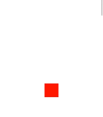
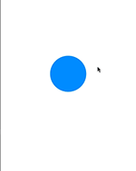
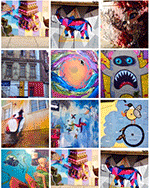

# November 17-November 23, 2016

This weekly update captures what changed in a given week across the Material Motion ecosystem.

Check out [current focus](current_focus) to see what we're working on next.

Check out [stability](stability) to learn about the current state of each feature.

## Meta


## People involved in this sprint

[](https://github.com/appsforartists)
[](https://github.com/jverkoey)
[](https://github.com/pingpongboss)

## What has changed

Legend:

- 🎉: something launched! Click to view the release notes.
- 📝: something was worked on.

| [Tech stack](https://material-motion.github.io/material-motion/starmap/specifications/#tech-stack)                        | Starmap | Apple | Android | Web |
|:--------------|:-------:|:-----:|:-------:|:---:|
| [Runtime](https://material-motion.github.io/material-motion/starmap/specifications/runtime/)                              |   |🎉 |   |📝 |
| [Interactions](https://material-motion.github.io/material-motion/starmap/specifications/interactions/)                    |   |   |   |   |
| [Transitions](https://material-motion.github.io/material-motion/starmap/specifications/interactions/transitions/)         |📝 |📝 |   |   |
| [Serialization](https://material-motion.github.io/material-motion/starmap/specifications/serialization)                   |   |   |   |   |
| - | - | - | - | - |
| **[Motion language](https://material-motion.github.io/material-motion/starmap/specifications/motion-family)**             | **Starmap** | **Apple**  | **Android** | **Web**    |
| [ArcMove](https://material-motion.github.io/material-motion/starmap/specifications/plans/ArcMove)                         |   |   |   |   |
| [AppliesVelocity](https://material-motion.github.io/material-motion/starmap/specifications/plans/AppliesVelocity)         |📝 |[🎉](https://github.com/material-motion/pop-swift/releases/tag/v2.1.0) |   |   |
| [ChangeAnchorPoint](https://material-motion.github.io/material-motion/starmap/specifications/plans/ChangeAnchorPoint)     |   |   |   |   |
| [DirectlyManipulable](https://material-motion.github.io/material-motion/starmap/specifications/plans/DirectlyManipulable) |   |   |   |   |
| [Draggable](https://material-motion.github.io/material-motion/starmap/specifications/plans/Draggable)                     |   |   |   |📝 |
| [PausesSpring](https://material-motion.github.io/material-motion/starmap/specifications/plans/PausesSpring)               |🎉 |[🎉](https://github.com/material-motion/pop-swift/releases/tag/v2.1.0) |   |   |
| [Pinchable](https://material-motion.github.io/material-motion/starmap/specifications/plans/Pinchable)                     |   |   |   |   |
| [RemoveSpring](https://material-motion.github.io/material-motion/starmap/specifications/plans/RemoveSpring)               |   |   |   |   |
| [Rotatable](https://material-motion.github.io/material-motion/starmap/specifications/plans/Rotatable)                     |   |   |   |   |
| [ScrollReactor](https://material-motion.github.io/material-motion/starmap/specifications/plans/ScrollReactor)             |   |   |   |   |
| [SpringTo](https://material-motion.github.io/material-motion/starmap/specifications/plans/SpringTo)                       |   |   |   |📝 |
| [Tween](https://material-motion.github.io/material-motion/starmap/specifications/plans/Tween)                             |   |   |   |📝 |
| [TransitionSpring](https://material-motion.github.io/material-motion/starmap/specifications/plans/TransitionSpring)       |   |   |   |   |
| [TransitionTween](https://material-motion.github.io/material-motion/starmap/specifications/plans/TransitionTween)         |   |   |   |   |
| - | - | - | - | - |
| **Interactions**      | **Starmap** | **Apple** | **Android** | **Web** |
|  Color interpolation  |   |   |    |   |
|  Parallax scrolling   |   |   |    |   |
|  Sentence builder     |   |   |    |   |
|  Sparkle Dialog       |   |   |    |   |
|  Photo transition     |   |📝 |    |   |

## Starmap

Updates to [`AppliesVelocity`](https://material-motion.github.io/material-motion/starmap/specifications/plans/AppliesVelocity)
and [`PausesSpring`](https://material-motion.github.io/material-motion/starmap/specifications/plans/PausesSpring) due to iterations on photo transition example.

## Android platform

## Apple platforms

🎉 **Runtime** Published v6.0.1. [View the release notes](https://github.com/material-motion/runtime-objc/releases/tag/v6.0.1).

🎉 **Runtime** is now synced internally.

📝 **Runtime** internals have been significantly reworked and simplified. Unit test tools will soon be available for dependent libraries.

📝 **CoreAnimation** Working on block-based animation API. This feature will greatly improve the ability for existing code bases to move to Material Motion. [View the diff](http://codereview.cc/D1904).

Example UIKit code:

```
self.squareView!.alpha = 0
UIView.animate(withDuration: 1) {
  self.squareView!.alpha = 1
}
```

Equivalent Material Motion code (simply a replacement of `UIView.animate` with `runtime.tween`):

```swift
squareView.alpha = 0
runtime.tween(withDuration: 1) {
  squareView.alpha = 1
}
```

📝 **CoreAnimation** Working on block-based animation API. This feature will greatly improve the ability for existing code bases to move to Material Motion. [View the diff](http://codereview.cc/D1904).

📝 **CoreAnimation** Built a demo of a scroll-view-driven animation using the Timeline:



🎉 **CoreAnimation transitions** Published v1. [View the release notes](https://github.com/material-motion/coreanimation-transitions-swift/releases/tag/v1.0.0).

Includes the [`TransitionTween`](https://material-motion.github.io/material-motion/starmap/specifications/plans/TransitionTween) motion language term.

🎉 **POP transitions** Published v1. [View the release notes](https://github.com/material-motion/pop-transitions-swift/releases/tag/v1.0.0).

Includes the [`TransitionSpring`](https://material-motion.github.io/material-motion/starmap/specifications/plans/TransitionSpring) motion language term.

🎉 **POP** Published v2 and v2.1. [View the v2 release notes](https://github.com/material-motion/pop-swift/releases/tag/v2.0.0). [View the v2.1 release notes](https://github.com/material-motion/pop-swift/releases/tag/v2.1.0).

Includes the [`PausesSpring`](https://material-motion.github.io/material-motion/starmap/specifications/plans/PausesSpring) and [`AppliesVelocity`](https://material-motion.github.io/material-motion/starmap/specifications/plans/AppliesVelocity) motion language terms.

Example describing a "tossable element" interaction:

```swift
runtime.addPlans([
  // Allow the element to be dragged.
  Draggable(withGestureRecognizer: pan),

  // Always be anchored to the provided position.
  SpringTo(position, destination: anchoredPosition),

  // Pauses the spring simulation while the gesture recognizer is active.
  PausesSpring(position, whileActive: pan),

  // Feeds the pan gesture recognizer's velocity into the spring on gesture completion.
  AppliesVelocity(position, onCompletionOf: pan)
], to: layer)
```



📝 **Transitions** Nearled landed the Photo Transition demo. [View the diff](http://codereview.cc/D1905).

Latest demo showing a fully functional "flick-to-dismiss" interaction on the photo. Note that velocity from the gesture feeds into the spring simulation:



## Web frameworks

📝 **WebAnimations** Iterating on Tween implementation. [View the diff](http://codereview.cc/D1991).

📝 **Prototype** Working prototype of `SpringTo`, `Draggable`, and `Tween` proved out with the Runtime v1. [View the codepen](http://codepen.io/anon/pen/QGdGRp?editors=1111).

## Learn more

Join us on Discord! [discord.gg/ZJyGXza](https://discord.gg/ZJyGXza)

