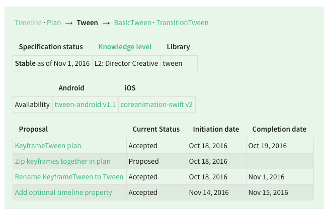

# December 02-07, 2016

Want to contribute? Check out our [Android](https://material-motion.github.io/milemarker/index.html?filterby=android) and
[iOS](https://material-motion.github.io/milemarker/index.html?filterby=appleos) milestones, many of
which are ready for someone to take ownership of. Also check out our
[newbie-friendly tasks](https://material-motion.github.io/milemarker/newbie.html?filterby=appleos).

---

This weekly update captures what changed in a given week across the Material Motion ecosystem.

Check out [current focus](current_focus) to see what we're working on next.

Check out [stability](stability) to learn about the current state of each feature.

## Meta

Team was together in San Francisco for the entire sprint. We sprinted hard on proving out the
underlying streams architecture that will make it possible to build connected and constraint-based
interactions.

## People involved in this sprint

Legend:

- 🎉: something launched! Click to view the release notes.
- 📝: something was worked on.

## Current state

> Note: After this week we will start showing a diff of the following table using our new
> `mdm shields text` command.

### Android platform support

| Library | Build status | Coverage | Version | Issues |
|---------|:------------:|:--------:|:-------:|:------:|
| [catalog-android](https://github.com/material-motion/catalog-android/) |  |  |  | 0 open |
| [conventions-android](https://github.com/material-motion/conventions-android/) |  |  |  | 0 open |
| [experiments-android](https://github.com/material-motion/experiments-android/) |  |  |  | 0 open |
| [expression-android](https://github.com/material-motion/expression-android/) |  |  |  | 2 open |
| [family-direct-manipulation-android](https://github.com/material-motion/family-direct-manipulation-android/) | passing | 100% | v1.2.0 | 2 open |
| [family-rebound-android](https://github.com/material-motion/family-rebound-android/) | passing | 100% | v1.1.0 | 3 open |
| [family-tween-android](https://github.com/material-motion/family-tween-android/) | passing | 100% | v2.1.0 | 2 open |
| [gestures-android](https://github.com/material-motion/gestures-android/) | passing | 95% | v1.0.0 | 2 open |
| [indefinite-observable-android](https://github.com/material-motion/indefinite-observable-android/) |  |  | v1.0.0 | 0 open |
| [runtime-android](https://github.com/material-motion/runtime-android/) | passing | 99% | v6.0.1 | 11 open |
| [streams-android](https://github.com/material-motion/streams-android/) |  |  |  | 0 open |
| [transitions-android](https://github.com/material-motion/transitions-android/) |  |  |  | 9 open |

### Apple platform support

| Library | Build status | Coverage | Version | Platforms | Docs | Issues |
|---------|:------------:|:--------:|:-------:|:---------:|:----:|:------:|
| [catalog-swift](https://github.com/material-motion/catalog-swift) | passing |  |  |  |  | 10 open |
| [conventions-objc](https://github.com/material-motion/conventions-objc) |  |  |  |  |  | 0 open |
| [coreanimation-swift](https://github.com/material-motion/coreanimation-swift) | passing | 61% | v2.0.0 | ios |  | 6 open |
| [coreanimation-transitions-swift](https://github.com/material-motion/coreanimation-transitions-swift) | passing | 84% | v1.0.0 | ios | -1% | 0 open |
| [direct-manipulation-swift](https://github.com/material-motion/direct-manipulation-swift) | passing | 84% | v1.1.0 | ios |  | 5 open |
| [indefinite-observable-swift](https://github.com/material-motion/indefinite-observable-swift) | passing | 100% | v2.0.0 | ios / osx | 50% | 2 open |
| [pop-swift](https://github.com/material-motion/pop-swift) | passing | 42% | v1.1.0 | ios | 21% | 6 open |
| [pop-transitions-swift](https://github.com/material-motion/pop-transitions-swift) | passing | 71% | v1.0.0 | ios |  | 0 open |
| [runtime-objc](https://github.com/material-motion/runtime-objc) | passing | 91% | v6.0.1 | ios | 100% | 16 open |
| [streams-swift](https://github.com/material-motion/streams-swift) |  |  |  |  |  | 5 open |
| [transitions-objc](https://github.com/material-motion/transitions-objc) | passing | 48% | v1.1.0 | ios | 90% | 5 open |

### Web platform support

| Library | Build status | Coverage | Version | Issues |
|---------|:------------:|:--------:|:-------:|:------:|
| [indefinite-observable-js](https://github.com/material-motion/indefinite-observable-js) |  |  | v0.1.0 | 4 open |
| [material-motion-js](https://github.com/material-motion/material-motion-js) |  |  |  | 48 open |
| [streams-experiment-js](https://github.com/material-motion/streams-experiment-js) |  |  |  | 1 open |

### Misc libraries

| Library | Build status | Coverage | Version | Issues |
|---------|:------------:|:--------:|:-------:|:------:|
| [apidiff](https://github.com/material-motion/apidiff/) | passing | 86% | v1.0.0 | 10 open |
| [direct-web](https://github.com/material-motion/direct-web/) |  |  |  | 0 open |
| [hubot](https://github.com/material-motion/hubot/) |  |  |  | 0 open |
| [material-motion](https://github.com/material-motion/material-motion/) |  |  |  | 16 open |
| [milemarker](https://github.com/material-motion/milemarker/) |  |  |  | 18 open |
| [sprints](https://github.com/material-motion/sprints/) |  |  |  | 32 open |
| [starmap](https://github.com/material-motion/starmap/) |  |  |  | 44 open |
| [sublime](https://github.com/material-motion/sublime/) |  |  |  | 0 open |
| [tools](https://github.com/material-motion/tools/) |  |  |  | 93 open |

## Documentation

📝 Created the home for where our L1-L4 documentation will live. [View the home page](https://material-motion.github.io/material-motion/documentation/).

## Starmap

📝 Iterating on streams spec. [Start here](https://material-motion.github.io/material-motion/starmap/specifications/streams/IndefiniteObservable).

🎉 Starmap now shows spec dependencies, knowledge levels, and the expected library a spec would live
   within for every spec page.

## Android platform

🎉 Released indefinite-observable-android. [View the repo](https://github.com/material-motion/indefinite-observable-android).

📝 Iterating on streams foundation.

## Apple platforms

🎉 Released indefinite-observable-swift. [View the repo](https://github.com/material-motion/indefinite-observable-swift).

📝 Iterating on streams foundation.

## Web frameworks

🎉 Released indefinite-observable-js. [View the repo](https://github.com/material-motion/indefinite-observable-js).

📝 Iterating on streams foundation.

## Tooling

🎉 New `mdm shields` command generates a GitHub org-wide dashboard. [View ours](https://material-motion.github.io/material-motion/).

## Learn more

Join us on Discord! [discord.gg/ZJyGXza](https://discord.gg/ZJyGXza)

