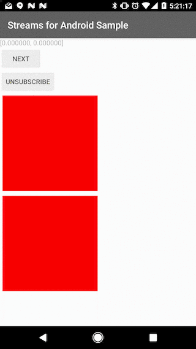
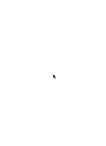
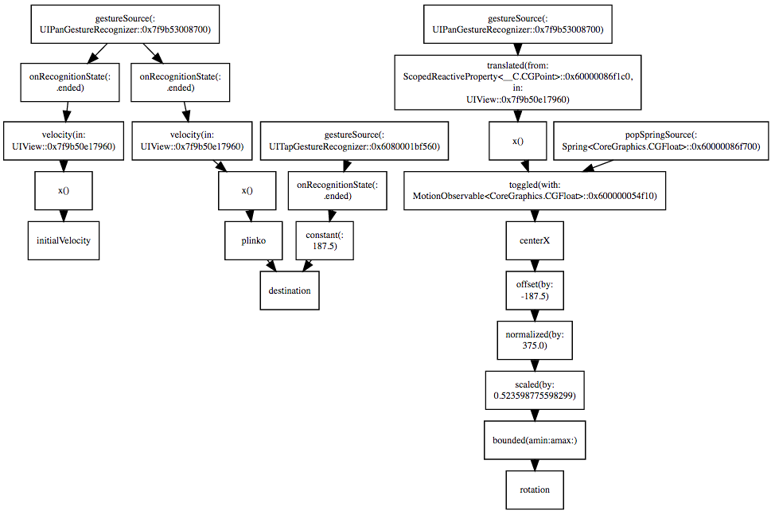
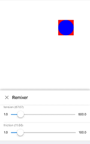
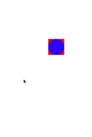

# December 15-21, 2016

Want to contribute? Check out our [Android](https://material-motion.github.io/milemarker/index.html?filterby=android) and
[iOS](https://material-motion.github.io/milemarker/index.html?filterby=appleos) milestones, many of
which are ready for someone to take ownership of. Also check out our
[newbie-friendly tasks](https://material-motion.github.io/milemarker/newbie.html?filterby=appleos).

---

This weekly update captures what changed in a given week across the Material Motion ecosystem.

Check out [current focus](current_focus) to see what we're working on next.

Check out [stability](stability) to learn about the current state of each feature.

## Meta

Continued refinement of our reactive motion architecture. Starting to wind down for year-end
vacations.

[View all of our contributors](https://github.com/material-motion/material-motion/blob/gh-pages/CONTRIBUTORS.md)

## Starmap

📝 Significant consolidation and cleanup of starmap content.

[View all changes since last week](https://github.com/material-motion/material-motion/compare/2016-12-14...2016-12-21)

## Android platform

🎉 Streams MVP completed.

Includes gesture and spring stream sources.



## Apple platforms

📝 Prototyping interruptible bi-directional transitions with new reactive architecture.

📝 Modal dialog built with new reactive transitions architecture.



📝 Exploring concept of an "Interaction" as a unit of reusable motion.

📝 Prototype of a reactive interaction.


In this example, we update the card's rotation in reaction to changes to its center position.

```swift
let rotationStream =
  propertyOf(card).centerX
  .offset(by: -view.bounds.width / 2)
  .normalized(by: view.bounds.width)
  .scaled(by: CGFloat(radians))
  .bounded(amin: -radians / 2, amax: radians / 2)
aggregator.write(rotationStream, to: propertyOf(card).rotation)
```

📝 Prototyping introspection of an interaction. The following diagram shows a rendered version of
the complete interaction shown above:



📝 [chuga](https://github.com/chuga) from the Remixer team prototyped a combination of Remixer and
Material Motion. An example of using Remixer to modify material motion spring configurations in real
time:



🎉 POP springs, Core Animation springs, Core Animation tweens, and gestures all landed as sources in
the new reactive architecture.

The following demo shows a Core Animation-backed spring animation that's reactively-interruptible:



The code for the above video uses two "Interactions": `TossableAndAttachWithSpring` and `Tap`. These
units of interaction are reusable pieces of motion. Over time we'll provide implementations of these
interactions on all platforms in the form of a consistent **library of motion**.

```swift
let tossable = TossableAndAttachWithSpring(position: propertyOf(square).center,
                                           to: propertyOf(circle).center,
                                           containerView: view,
                                           springSource: popSpringSource)
let tap = Tap(sets: tossable.destination, containerView: view)

[tossable, tap].forEach { interaction in interaction.connect(with: runtime) }
```

## Web frameworks

🎉 Added continuous integration.  See the badge on [our repo README](https://github.com/material-motion/material-motion-js/#readme).

🎉 `scrollSource` completed.

📝 Streams MVP nearing completion.

## Tooling

🎉 [tofuness](https://github.com/tofuness), one of our newest contributors, has helped get our
JavaScript testing environment up and running!

## Deltas

### Android platform support

| Library | Build status | Coverage | Version | Issues |
|---------|:------------:|:--------:|:-------:|:------:|
| [catalog-android](https://github.com/material-motion/catalog-android/) | {+passing+} | {+0%+} |  | 0 open |
| [conventions-android](https://github.com/material-motion/conventions-android/) |  |  |  | 0 open |
| [expression-android](https://github.com/material-motion/expression-android/) |  |  |  | 2 open |
| [family-direct-manipulation-android](https://github.com/material-motion/family-direct-manipulation-android/) | passing | 100% | v1.2.0 | 2 open |
| [family-rebound-android](https://github.com/material-motion/family-rebound-android/) | passing | 100% | v1.1.0 | 3 open |
| [family-tween-android](https://github.com/material-motion/family-tween-android/) | passing | 100% | v2.1.0 | 2 open |
| [gestures-android](https://github.com/material-motion/gestures-android/) | passing | [-95%-]{+91%+} | v1.0.0 | [-3-]{+4+} open |
| [indefinite-observable-android](https://github.com/material-motion/indefinite-observable-android/) | [-failing-]{+passing+} | [-95%-]{+100%+} | v2.0.0 | [-1-]{+0+} open |
| [runtime-android](https://github.com/material-motion/runtime-android/) | passing | 95% | v6.0.1 | 12 open |
| [streams-android](https://github.com/material-motion/streams-android/) | passing | [-100%-]{+81%+} | v1.0.0 | [-3-]{+6+} open |
| [transitions-android](https://github.com/material-motion/transitions-android/) |  |  |  | 9 open |

### Apple platform support

| Library | Build status | Coverage | Version | Platforms | Docs | Issues |
|---------|:------------:|:--------:|:-------:|:---------:|:----:|:------:|
| [catalog-swift](https://github.com/material-motion/catalog-swift) | passing |  |  |  |  | 10 open |
| [conventions-objc](https://github.com/material-motion/conventions-objc) |  |  |  |  |  | 0 open |
| [coreanimation-swift](https://github.com/material-motion/coreanimation-swift) | passing | 61% | v2.0.0 | ios |  | 6 open |
| [coreanimation-transitions-swift](https://github.com/material-motion/coreanimation-transitions-swift) | passing | 84% | v1.0.0 | ios | -1% | 0 open |
| [direct-manipulation-swift](https://github.com/material-motion/direct-manipulation-swift) | passing | 84% | v1.1.0 | ios |  | 5 open |
| [indefinite-observable-swift](https://github.com/material-motion/indefinite-observable-swift) | passing | 100% | v3.1.0 | ios / osx | 54% | 0 open |
| [pop-swift](https://github.com/material-motion/pop-swift) | passing | 42% | v2.1.0  | -ios-  | 21% | 6 open |
| [pop-transitions-swift](https://github.com/material-motion/pop-transitions-swift) | passing | 71% | v1.0.0 | ios |  | 0 open |
| [runtime-objc](https://github.com/material-motion/runtime-objc) | passing | 91% | v6.0.1 | ios | 100% | 16 open |
| [streams-swift](https://github.com/material-motion/material-motion-swift) | passing | [-51%-]{+20%+} |  |  |  | [-5-]{+0+} open |
| [transitions-objc](https://github.com/material-motion/transitions-objc) | passing | 48% | v1.1.0 | ios | 90% | 5 open |

### Web platform support

| Library | Build status | Coverage | Version | Issues |
|---------|:------------:|:--------:|:-------:|:------:|
| [indefinite-observable-js](https://github.com/material-motion/indefinite-observable-js) | passing | 100% | v0.3.0 | 4 open |
| [material-motion-js](https://github.com/material-motion/material-motion-js) | {+passing+} |  |  | [-54-]{+57+} open |
| [streams-experiment-js](https://github.com/material-motion/streams-experiment-js) |  |  |  | 1 open |

### Misc libraries

| Library | Build status | Coverage | Version | Issues |
|---------|:------------:|:--------:|:-------:|:------:|
| [apidiff](https://github.com/material-motion/apidiff/) | passing | 86% | v1.0.0 | 11 open |
| [chrome-inspector](https://github.com/material-motion/chrome-inspector/) |  |  |  | 4 open |
| [direct-web](https://github.com/material-motion/direct-web/) |  |  |  | 0 open |
| [hubot](https://github.com/material-motion/hubot/) |  |  |  | 0 open |
| [material-motion](https://github.com/material-motion/material-motion/) |  |  |  | 16 open |
| [milemarker](https://github.com/material-motion/milemarker/) |  |  |  | 18 open |
| [sprints](https://github.com/material-motion/sprints/) |  |  |  | 32 open |
| [starmap](https://github.com/material-motion/starmap/) |  |  |  | [-43-]{+45+} open |
| [sublime](https://github.com/material-motion/sublime/) |  |  |  | [-1-]{+4+} open |
| [tools](https://github.com/material-motion/tools/) |  |  |  | [-96-]{+97+} open |

## Learn more

Join us on Discord! [discord.gg/ZJyGXza](https://discord.gg/ZJyGXza)

