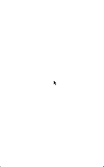

# January 19-25, 2017

Want to contribute? Check out our [Android](https://material-motion.github.io/milemarker/index.html?filterby=android) and
[iOS](https://material-motion.github.io/milemarker/index.html?filterby=appleos) milestones, many of
which are ready for someone to take ownership of. Also check out our
[newbie-friendly tasks](https://material-motion.github.io/milemarker/newbie.html?filterby=appleos).

---

This weekly update captures what changed in a given week across the Material Motion ecosystem.

Check out [current focus](current_focus) to see what we're working on next.

Check out [stability](https://material-motion.github.io/material-motion/) to learn about the current state of each feature.

## Meta

[View all of our contributors](https://github.com/material-motion/material-motion/blob/gh-pages/CONTRIBUTORS.md)

## Android platform

## Apple platforms

🎉 L1 Interaction APIs have reached some semblance of stability. Starting to send code out for
review and will begin building more examples and case studies.

🎉 Built a reactive modal dialog transition where the dialog comes in at an angle and reacts to
gestural interaction as expected.

## Web frameworks

## Tooling

## Deltas

### Android platform support

| Library | Build status | Coverage | Version | Issues |
|---------|:------------:|:--------:|:-------:|:------:|
| [catalog-android](https://github.com/material-motion/catalog-android/) | passing | 0% |  | 0 open |
| [conventions-android](https://github.com/material-motion/conventions-android/) |  |  |  | 0 open |
| [expression-android](https://github.com/material-motion/expression-android/) |  |  |  | 2 open |
| [family-direct-manipulation-android](https://github.com/material-motion/family-direct-manipulation-android/) | passing | 100% | v1.2.0 | 2 open |
| [family-rebound-android](https://github.com/material-motion/family-rebound-android/) | passing | 100% | v1.1.0 | 3 open |
| [family-tween-android](https://github.com/material-motion/family-tween-android/) | passing | 100% | v2.1.0 | 2 open |
| [gestures-android](https://github.com/material-motion/gestures-android/) | passing | 91% | v1.0.0 | 4 open |
| [indefinite-observable-android](https://github.com/material-motion/indefinite-observable-android/) | passing | 100% | v2.0.0 | 0 open |
| [runtime-android](https://github.com/material-motion/runtime-android/) | passing | 95% | v6.0.1 | [-12-]{+13+} open |
| [streams-android](https://github.com/material-motion/streams-android/) | passing | [-44%-]{+39%+} | v1.0.0 | 14 open |
| [transitions-android](https://github.com/material-motion/transitions-android/) |  |  |  | 9 open |

### Apple platform support

| Library | Build status | Coverage | Version | Platforms | Docs | Issues |
|---------|:------------:|:--------:|:-------:|:---------:|:----:|:------:|
| [catalog-swift](https://github.com/material-motion/catalog-swift) | passing |  |  |  |  | 10 open |
| [conventions-objc](https://github.com/material-motion/conventions-objc) |  |  |  |  |  | 0 open |
| [coreanimation-swift](https://github.com/material-motion/coreanimation-swift) | passing | 61% | v2.0.0 | ios |  | 6 open |
| [coreanimation-transitions-swift](https://github.com/material-motion/coreanimation-transitions-swift) | passing | 84% | v1.0.0 | ios | -1% | 0 open |
| [direct-manipulation-swift](https://github.com/material-motion/direct-manipulation-swift) | passing | 84% | v1.1.0 | ios |  | 5 open |
| [indefinite-observable-swift](https://github.com/material-motion/indefinite-observable-swift) | passing | 100% | v3.1.0 | ios / osx | 54% | 0 open |
| [pop-swift](https://github.com/material-motion/pop-swift) | passing | 42% |  |  | 21% | 6 open |
| [pop-transitions-swift](https://github.com/material-motion/pop-transitions-swift) | passing | 71% | v1.0.0 | ios |  | 0 open |
| [runtime-objc](https://github.com/material-motion/runtime-objc) | passing | 91% | v6.0.1 | ios | 100% | 16 open |
| [streams-swift](https://github.com/material-motion/streams-swift) | passing | [-13%-]{+12%+} |  |  |  | 2 open |
| [transitions-objc](https://github.com/material-motion/transitions-objc) | passing | 48% | v1.1.0 | ios | 90% | 5 open |

### Web platform support

| Library | Build status | Coverage | Version | Issues |
|---------|:------------:|:--------:|:-------:|:------:|
| [indefinite-observable-js](https://github.com/material-motion/indefinite-observable-js) | passing | 100% | [-v0.3.0-]{+v1.0.1+} | 3 open |
| [material-motion-js](https://github.com/material-motion/material-motion-js) | passing |  |  | [-40-]{+41+} open |
| [streams-experiment-js](https://github.com/material-motion/streams-experiment-js) |  |  |  | 1 open |

### Misc libraries

| Library | Build status | Coverage | Version | Issues |
|---------|:------------:|:--------:|:-------:|:------:|
| [apidiff](https://github.com/material-motion/apidiff/) | passing | 86% | v1.0.0 | 11 open |
| [chrome-inspector](https://github.com/material-motion/chrome-inspector/) |  |  |  | 4 open |
{+| [ci-staging-area](https://github.com/material-motion/ci-staging-area/) |  |  |  | 0 open |+}
| [direct-web](https://github.com/material-motion/direct-web/) |  |  |  | 0 open |
| [hubot](https://github.com/material-motion/hubot/) |  |  |  | 0 open |
| [material-motion](https://github.com/material-motion/material-motion/) |  |  |  | 37 open |
| [milemarker](https://github.com/material-motion/milemarker/) |  |  |  | 18 open |
| [sprints](https://github.com/material-motion/sprints/) |  |  |  | 32 open |
| [starmap](https://github.com/material-motion/starmap/) |  |  |  | 48 open |
| [sublime](https://github.com/material-motion/sublime/) |  |  |  | 4 open |
| [tools](https://github.com/material-motion/tools/) |  |  |  | 100 open |

## Learn more

Join us on Discord! [discord.gg/ZJyGXza](https://discord.gg/ZJyGXza)

