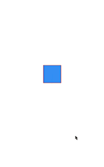
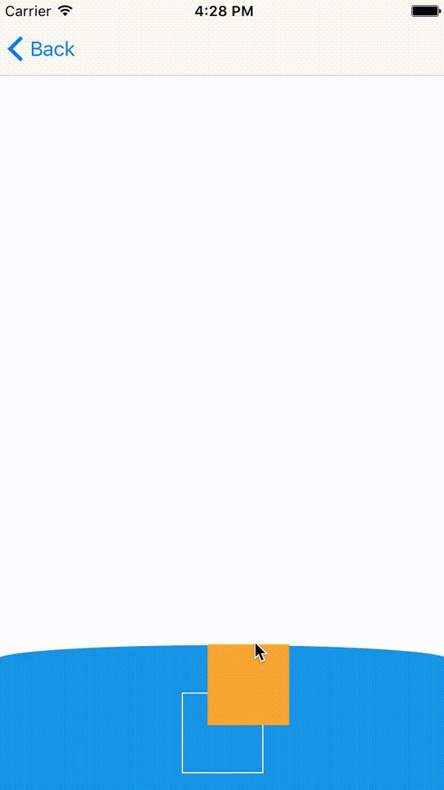

# February 09-15, 2017

Want to contribute? Check out our [Android](https://material-motion.github.io/milemarker/index.html?filterby=android) and
[iOS](https://material-motion.github.io/milemarker/index.html?filterby=appleos) milestones, many of
which are ready for someone to take ownership of. Also check out our
[newbie-friendly tasks](https://material-motion.github.io/milemarker/newbie.html?filterby=appleos).

---

This weekly update captures what changed in a given week across the Material Motion ecosystem.

Check out [current focus](current_focus) to see what we're working on next.

Check out [stability](https://material-motion.github.io/material-motion/) to learn about the current state of each feature.

## Meta

🎉 Core team spent most of the week preparing for and presenting an architectural overview talk for Google.

We have archived all pre-reactive libraries as part of a general cleanup effort in preparation for
our end of month API freeze. [View the old libraries](https://github.com/material-motion-archive).

## Android platform

🎉 Formalized using reactive properties as interaction input/output.
Case study: Tossable and Tap.


```
Tossable tossable = new Tossable(ReactiveProperty.of(ViewProperties.POSITION.get(target)));
runtime.addInteraction(tossable, target);

Tap tap = new Tap(container);
runtime.addInteraction(tap, tossable.anchor);
```

📝 Formalizing `Interaction.enabled` reactive property as a way to pause interactions.

📝 Importing Material Motion into `google3/third_party`. Internal integration to come soon.

📝 Componentizing `physics-android` library to potentially replace `rebound`.

## Apple platforms

🎉 Eliminated the state channel on MotionObservable. This resolves a class of problems related to
connecting gesture recognizers and springs.

📝 Exploring debug visualizations for path-based tweens.



📝 Exploring a prototype of a "breakable rubber band".



## Web frameworks

📝 Working on collaboration between gestures and springs in [bottom sheet demo](https://material-motion-demos.firebaseapp.com/bottom-sheet/).

## Deltas

### Android platform support

| Library | Build status | Coverage | Version | Issues |
|---------|:------------:|:--------:|:-------:|:------:|
| [conventions-android](https://github.com/material-motion/conventions-android/) |  |  |  | 0 open |
| [gestures-android](https://github.com/material-motion/gestures-android/) | passing | 91% | v1.0.0 | 4 open |
| [indefinite-observable-android](https://github.com/material-motion/indefinite-observable-android/) | passing | 100% | v2.0.0 | 0 open |
| [physics-android](https://github.com/material-motion/physics-android/) |  |  |  | 0 open |
| [streams-android](https://github.com/material-motion/streams-android/) | passing | 27% | v1.0.0 | 12 open |

### Apple platform support

| Library | Build status | Coverage | Version | Platforms | Docs | Issues |
|---------|:------------:|:--------:|:-------:|:---------:|:----:|:------:|
| [catalog-swift](https://github.com/material-motion/catalog-swift) | passing |  |  |  |  | 10 open |
| [conventions-objc](https://github.com/material-motion/conventions-objc) |  |  |  |  |  | 0 open |
| [indefinite-observable-swift](https://github.com/material-motion/indefinite-observable-swift) | passing | 100% | v3.1.0 | ios / osx | 54% | 0 open |
[ [streams-swift](https://github.com/material-motion/streams-swift) | passing | 6% |  |  |  | 13 open |

### Web platform support

| Library | Build status | Coverage | Version | Issues |
|---------|:------------:|:--------:|:-------:|:------:|
| [indefinite-observable-js](https://github.com/material-motion/indefinite-observable-js) | passing | 100% | v1.0.1 | 3 open |
| [material-motion-js](https://github.com/material-motion/material-motion-js) | passing |  |  | 41 open |

### Misc libraries

| Library | Build status | Coverage | Version | Issues |
|---------|:------------:|:--------:|:-------:|:------:|
| [apidiff](https://github.com/material-motion/apidiff/) | passing | 86% | v1.0.0 | 11 open |
| [chrome-inspector](https://github.com/material-motion/chrome-inspector/) |  |  |  | 4 open |
| [ci-staging-area](https://github.com/material-motion/ci-staging-area/) |  |  |  | 0 open |
| [direct-web](https://github.com/material-motion/direct-web/) |  |  |  | 0 open |
| [material-motion](https://github.com/material-motion/material-motion/) |  |  |  | [-38-]{+39+} open |
| [milemarker](https://github.com/material-motion/milemarker/) |  |  |  | 18 open |
| [starmap](https://github.com/material-motion/starmap/) |  |  |  | 48 open |
| [sublime](https://github.com/material-motion/sublime/) |  |  |  | 4 open |
| [tools](https://github.com/material-motion/tools/) |  |  |  | [-100-]{+101+} open |

## Learn more

Join us on Discord! [discord.gg/ZJyGXza](https://discord.gg/ZJyGXza)

