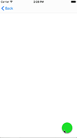
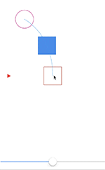

# February 16-22, 2017

This weekly update captures what changed in a given week across the Material Motion ecosystem.

## Meta

[View all of our contributors](https://github.com/material-motion/material-motion/blob/gh-pages/CONTRIBUTORS.md)

## Starmap

🎉 Major cleanup to the starmap's content. Observables, Reactive properties, MotionRuntime, and Operators sections all updated with latest specs.

## Android platform

## Apple platforms

🎉 Implemented a floating action button masked circular reveal transition.

## Web frameworks

## Tooling

📝 More path animation debug tooling explorations. Path tweens can now render their paths on a visualization layer.

## Current state

### Android platform support

| Library | Build status | Coverage | Version | Issues |
|---------|:------------:|:--------:|:-------:|:------:|
| [conventions-android](https://github.com/material-motion/conventions-android/) |  |  |  | 0 open |
| [gestures-android](https://github.com/material-motion/gestures-android/) | passing | 91% | v1.0.0 | 4 open |
| [indefinite-observable-android](https://github.com/material-motion/indefinite-observable-android/) | passing | 100% | v2.0.0 | 0 open |
| [physics-android](https://github.com/material-motion/physics-android/) |  |  |  | 0 open |
| [-[streams-android](https://github.com/material-motion/streams-android/)-]{+[reactive-motion-android](https://github.com/material-motion/reactive-motion-android/)+} | passing | [-27%-]{+26%+} | v1.0.0 | 12 open |
| [reactive-motion-rebound-android](https://github.com/material-motion/reactive-motion-rebound-android/) |  |  |  | 0 open |

### Apple platform support

| Library | Build status | Coverage | Version | Platforms | Docs | Issues |
|---------|:------------:|:--------:|:-------:|:---------:|:----:|:------:|
| [catalog-swift](https://github.com/material-motion/catalog-swift) | passing |  |  |  |  | 10 open |
| [conventions-objc](https://github.com/material-motion/conventions-objc) |  |  |  |  |  | 0 open |
| [indefinite-observable-swift](https://github.com/material-motion/indefinite-observable-swift) | passing | 100% | v3.1.0 | ios / osx | 54% | 0 open |
| [-[streams-swift](https://github.com/material-motion/streams-swift)-]{+[reactive-motion-swift](https://github.com/material-motion/reactive-motion-swift)+} | passing | 6% |  |  |  | [-15-]{+18+} open |

### Web platform support

| Library | Build status | Coverage | Version | Issues |
|---------|:------------:|:--------:|:-------:|:------:|
| [indefinite-observable-js](https://github.com/material-motion/indefinite-observable-js) | passing | 100% | v1.0.1 | 3 open |
| [material-motion-js](https://github.com/material-motion/material-motion-js) | passing |  |  | 43 open |

### Misc libraries

| Library | Build status | Coverage | Version | Issues |
|---------|:------------:|:--------:|:-------:|:------:|
| [apidiff](https://github.com/material-motion/apidiff/) | passing | 86% | v1.0.0 | 11 open |
| [chrome-inspector](https://github.com/material-motion/chrome-inspector/) |  |  |  | 4 open |
| [direct-web](https://github.com/material-motion/direct-web/) |  |  |  | 0 open |
| [material-motion](https://github.com/material-motion/material-motion/) |  |  |  | 39 open |
| [milemarker](https://github.com/material-motion/milemarker/) |  |  |  | 18 open |
| [starmap](https://github.com/material-motion/starmap/) |  |  |  | [-48-]{+37+} open |
| [sublime](https://github.com/material-motion/sublime/) |  |  |  | 4 open |
| [tools](https://github.com/material-motion/tools/) |  |  |  | [-101-]{+100+} open |

## Learn more

Join us on Discord! [discord.gg/ZJyGXza](https://discord.gg/ZJyGXza)

