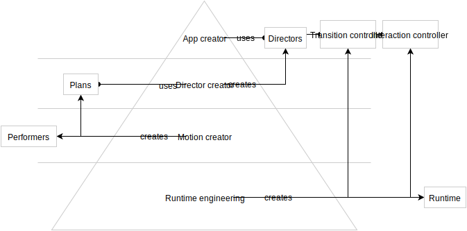

# Engineering

### Knowledge levels

#### L1: App Creator

Wants a one-liner use case for adding Material Motion to their app. For example:

    transitionController.director = PhotoTransition.

Will generally just use — and potentially compose — pre-built directors in order to describe interactions. The pre-built directors might come from the material motion catalog or from elsewhere.

#### L2: Director Creator

May be an App Creator who was unable to express their desired interaction with the pre-packaged Directors. A Director Creator must now learn how to use plans to describe interactions and to create custom Directors. The resulting director will get added to the list of Directors used by the App Creators.

#### L3: Motion Creator

May be a Director Creator who was unable to express their desired interaction with the pre-packaged plans. A Motion Creator must now learn how to create new motion families (plans/performers) that can describe the types of motion they desire. The resulting motion families will be used by Director Creators.

#### L4: Runtime engineering

The Creator has decided that there is some functionality missing from all of the above knowledge areas, and has now decided to make modifications to the Runtime. This may result in modifications to the Scheduler, the Plan/Performer protocols, or other aspects of the Runtime as a whole.

### Pivotal journey: First use of Material Motion in an existing app

#### Assumptions

The person is familiar with their platform and their platform’s dominant package management solution.

#### Result

Material Motion transition or interaction integrated into an existing app.

#### Ideal journey (does not exist yet)

1. Visit &lt;material motion website&gt;. 
2. Select a platform. 
3. Read a one-pager download and integration guide. 
4. Add dependencies to the app. 
5. Add lines of code required to use a director. 
6. Build and run the app. 

### Pivotal journey: Create a new director

#### Assumptions

The person is familiar with Material Motion’s concept of “directors”.

#### End-goal

Create a new transition or interaction director and use it in an app.

#### Ideal journey (does not exist yet)

1. Visit &lt;material motion website&gt;. 
2. Visit &lt;guides | tutorials&gt;. 
3. Read a one-pager on creating a new director. 
4. Create a new director in code. 
5. Add dependencies for needed motion families. 
6. Integrate the director in the app. 
7. Build and run the app. 

### Pivotal journey: Create a new motion family

#### Assumptions

The person is familiar with Material Motion’s concept of “motion families”.

#### End-goal

Create a new motion family and use it in a director.

#### Ideal journey (does not exist yet)

1. Visit &lt;material motion website&gt;. 
2. Visit &lt;guides | tutorials&gt;. 
3. Read a one-pager on creating a new motion family. 
4. Create new plan/performer types. 
5. Use the new plans in a director. 
6. Integrate the director in the app. 
7. Build and run the app. 

### Pivotal journey: Onboard a new contributor

#### Assumptions

The person has already made some minor contributions to the project or is intending to join the team in a regularly-contributing capacity.

#### End-goal

All code review tooling installed and ready to use. Able to run arc diff successfully.

#### Ideal journey (does not exist yet)

1. Visit &lt;material motion website&gt;. 
2. Visit &lt;Contributing?&gt;. 
3. Read a one-pager on onboarding. 

#### Journey

1. Pings a core team member, either via Discord or directly. 
2. Person is told to visit the [Onboarding doc](https://material-motion.gitbooks.io/material-motion-team/content/essentials/frequent_contributors/onboarding.html). 
3. Follows the steps outlined in the doc. 

### Toothbrush journey: Publish a diff

#### Assumptions

The engineer has read the Onboarding documentation and is able to run arc diff. The engineer is a “frequent contributor”.

#### End-goal

Publish a local change to the GitHub repository’s develop branch.

#### Journey

1. Creates a local git branch with a variety of changes. 
2. Runs arc diff to generate a diff for review. Diff is published to codereview.cc. Diff is auto-assigned reviewer groups. 
3. Receives feedback from peers. 
4. Iterates on local changes. Runs arc diff again to update the diff. 
5. Receives an LGTM from a peer. 
6. Lands the diff onto origin/develop with arc land. 

### Toothbrush journey: Send a pull request

#### Assumptions

#### End-goal

#### Journey

### Toothbrush journey: File an issue

#### Assumptions

#### End-goal

#### Ideal journey (does not exist yet)

#### Journey

### Toothbrush journey: Cut a release

#### Assumptions

#### End-goal

#### Ideal journey (does not exist yet)

### Journey