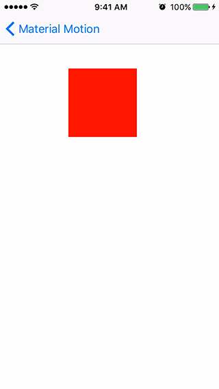
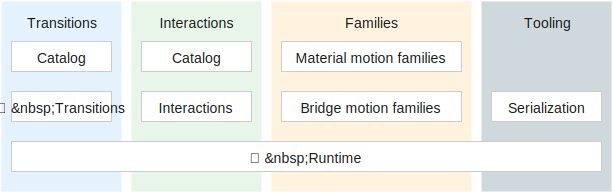
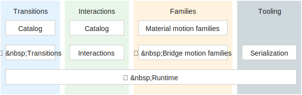
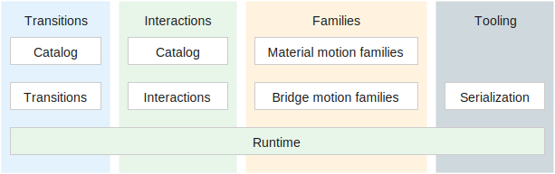

# August 11-17, 2016

## Hackweek summary

The core team met in San Francisco last week for an in-person hackathon. Here's the summary of things we explored:

- Composability of plans/performers. [Read the spec](https://material-motion.gitbooks.io/material-motion-starmap/content/specifications/runtime/performer-composition.html).
- Tossable demo for Android, Apple, and Web.

## Meta

🏠 NYC core team members back in NYC.

## 🌟 Starmap 🗺

📝 Drafting the [Motion family](https://material-motion.gitbooks.io/material-motion-starmap/content/specifications/motion-family.html) and [Serialization](https://material-motion.gitbooks.io/material-motion-starmap/content/specifications/serialization.html) spec.

## Android platform

## Apple platforms

🎉 [Gestures](https://github.com/material-motion/material-motion-family-gestures-swift) motion family now available.

🎉 [POP](https://github.com/material-motion/material-motion-family-pop-swift) motion family now available.

## Web frameworks

## Tooling

📝 Improving our [team onboarding](https://material-motion.gitbooks.io/material-motion-team/content/essentials/frequent_contributors/onboarding.html) documentation and tools as we've been taking on new 20%'ers.

## Learn more

Join us on Discord! [discord.gg/ZJyGXza](https://discord.gg/ZJyGXza)

